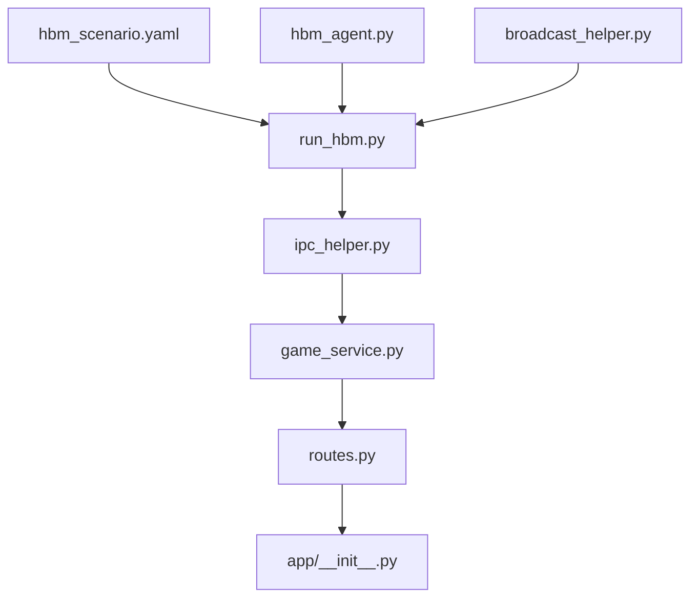

# HBM Demo 开发规划

**项目**：《HBM 显存价格保卫战》Web Demo  
**应用目录**：`agent_world/hbm_demo/`  
**技术规范**：`dev_docs/1_story_prototype.md`、`dev_docs/2_architecture.md`、`dev_docs/3_prompt_management.md`  
**实现注意**：`dev_logs/17_HBM_Demo实现注意事项.md`  
**约束**：不修改 `agent_world/demo/` 与引擎核心（`world/*`、`script/effects/*`、`dispatcher.py` 等）

---

## 一、目标与交付物

### 1.1 运行时架构

```text
[ 前端 ] ──POST player-turn / GET action-result──▶ [ Flask: routes + game_service ]
                                                          │ IPC + 只读 DB
                                                          ▼
                                                   [ run_hbm.py 子进程 ]
                                                   IPCServer + WorldStep + 7×HbmAgent
                                                   写 world.db / env_status.json
```

### 1.2 交付清单

| # | 文件 | 职责 |
|---|------|------|
| 1 | `hbm_scenario.yaml` | 场景配置（从 `3_prompt_management.md` 第七节合并） |
| 2 | `run_hbm.py` | Runner 入口：seed 世界、注册 Agent、IPC、inject handler |
| 3 | `hbm_agent.py` | LLM Agent：`update_memory`、工具适配、`scripted_notification` |
| 4 | `broadcast_helper.py` | Runner 内系统广播（`insert_message`） |
| 5 | `ipc_helper.py` | Flask 侧 `send_inject_batch` / `send_move_agent` |
| 6 | `game_service.py` | Stats、路由、session、WorldDB 查询、id→name |
| 7 | `routes.py` | Blueprint `/api/hbm/simulations/<sim_id>/...` |
| 8 | `app/__init__.py` | **一行**注册 `hbm_bp`（唯一引擎壳改动） |

可选：`sim/.gitignore`（忽略 `sim/hbm_memory_war/world.db` 等运行时产物）

### 1.3 不在本阶段范围

- 前端 UI（仅保证 API 契约）
- 修改引擎核心或 `agent_world/demo/`
- 关系类型注册类（MVP 用引擎 fallback meta）
- `state_updates` / 内心 OS 上帝视角（MVP 可跳过）

---

## 二、开发阶段（里程碑）

建议 **6 个 Phase、由底向上**，每 Phase 结束有可验证检查点。

### Phase 0 — 脚手架与配置（无 LLM）

**目标**：目录就绪、YAML 可加载、Runner 能启动并响应 IPC。

| 任务 | 说明 |
|------|------|
| P0-1 | 编写 `hbm_scenario.yaml`（places / coverage / capabilities / relations / groups / agents / clock / llm） |
| P0-2 | 从 `run_demo._seed_world` 复制 seed 逻辑到 `run_hbm._seed_world` |
| P0-3 | `run_hbm.py` 最小内核：WorldDB + PlaceStore + … + **仅 IPCServer**（无 Agent 循环） |
| P0-4 | 实现 `write_env_status(sim_dir, t)`，merge 保留 `current_tick`（避免 IPCServer 覆盖） |
| P0-5 | 注册 stub `handle_inject`（只返回 tick，不跑 WorldStep）+ `MOVE_AGENT` handler |
| P0-6 | `sim/hbm_memory_war/` 目录约定；文档启动命令可跑通 |

**验收**：

```bash
python -m agent_world.hbm_demo.run_hbm \
  --config agent_world/hbm_demo/hbm_scenario.yaml \
  --sim-dir agent_world/hbm_demo/sim/hbm_memory_war/
# 另开终端：LIST_PLACES / MOVE_AGENT IPC 有响应；env_status.json 含 current_tick
```

---

### Phase 1 — Runner 完整管线（有 LLM、无 Flask）

**目标**：inject → DialogueInjection → Agent 行动 → 消息落库。

| 任务 | 说明 |
|------|------|
| P1-1 | 实现 `HbmAgent`（参照 `demo_agent.py` + §3 第六节） |
| P1-2 | `world_state.register_agent` × 7；`PerceptionBuilder(script_engine=...)` |
| P1-3 | 挂载 `ScriptEngine` + `WorldStep` + buses + `ActionDispatcher(script_engine=...)` |
| P1-4 | **Tick 模型（§6.2）**：无后台空转主循环；**仅** `handle_inject` 内 `run_one_tick` 3–8 次 |
| P1-5 | `handle_inject` 支持 `events[]`、`broadcast`、`tick_count`；兼容单 `event` |
| P1-6 | 实现 `broadcast_helper.broadcast_place(world_db, place_store, place_id, msg, t)` |
| P1-7 | 本地脚本：手动发一条 inject，确认 Agent 1 F2F 或 RDC 1→2 写入 `world.db` |

**验收**：CLI 或临时脚本 inject 玩家台词后，`direct_message` 有新 F2F/RDC；`env_status.current_tick` 增加 3–8。

**参考源码**：

- `agent_world/demo/run_demo.py` — `_build_kernel`、Agent 循环模式（**不要**照搬无 IPC 主循环）
- `agent_world/runner/run_agent_world_simulation.py` — `_wire_ipc_handlers`、`ScriptEngine` 构造

---

### Phase 2 — Flask IPC 层

**目标**：Flask 能通过 IPC 驱动 Runner，不实现完整游戏逻辑。

| 任务 | 说明 |
|------|------|
| P2-1 | `ipc_helper.py`：`send_inject_batch`、`send_move_agent`（`SimulationIPCClient.send_command`） |
| P2-2 | `game_service.py` 骨架：`get_sim_dir()`（`HBM_SIM_DIR`）、只读 `WorldDB(timeout=5.0)` |
| P2-3 | `routes.py`：临时 `POST .../debug-inject` 或直接进入 player-turn 骨架 |
| P2-4 | `app/__init__.py` 注册 `hbm_bp` |
| P2-5 | Session 初始化：`POST .../session/start` 或在首次 player-turn 懒创建（写入初始 stats / phase / place_id） |

**验收**：Flask POST inject → Runner tick 推进 → GET 读 `env_status.json` 变化。

---

### Phase 3 — API 1 / API 2 主流程

**目标**：双段式异步交互跑通 Phase 1 前台剧情（Turn 1–4）。

| 任务 | 说明 |
|------|------|
| P3-1 | `game_service.score_stats()` — DeepSeek JSON delta（§4.2） |
| P3-2 | API 1 流程（§三步骤 1–9），**session.place_id** 为 inject 权威（§6.2.2） |
| P3-3 | Turn 4 Bad End 早退（stub `public_messages`） |
| P3-4 | API 2：`action-result` 结束条件 + `fetch_f2f_history_at` + RDC 白名单 Phase 1 |
| P3-5 | id→name 映射（scenario agents）；`sender_id=-1` →「彭博终端」 |
| P3-6 | `immediate_msg` 生成（可 1s 超时占位） |

**验收**：Turn 1 POST → GET 轮询 → 看到前台 F2F + 可选 RDC 1→2；Turn 4 低分 Bad End 不 inject。

---

### Phase 4 — 路由与四 Phase 剧情

**目标**：节点 A/B/C/D 与 Turn 16 剧本事件。

| 任务 | 说明 |
|------|------|
| P4-1 | 节点 A：`MOVE_AGENT` 2→`jensen_private_room`，更新 session phase/place/`phase2_start_tick` |
| P4-2 | Phase 2 inject 单 Agent 2；节点 B：正面 RDC 关键词判定 + 二次 inject PlaceMutation |
| P4-3 | Phase 3 **batch inject**（6 events）；Turn 16 broadcast + Sam（guard：`phase==Phase 3`） |
| P4-4 | 节点 C：三次 MOVE CEO；节点 D：Turn 25 意图分类 + `completed` 响应 |
| P4-5 | API 2 RDC 白名单按 session phase 切换 |

**验收**：手动或脚本模拟 25 Turn 路径，节点 A/B/C/D 与文档一致；Phase 未达标时 Turn 递增但 phase 不变。

---

### Phase 5 — 打磨与联调

| 任务 | 说明 |
|------|------|
| P5-1 | SQLite 读重试、API 2 在 IPC 返回后读库 |
| P5-2 | IPC / LLM 超时与错误 HTTP 码（504/502） |
| P5-3 | 日志：task_id、start_tick、end_tick、phase |
| P5-4 | README：双进程启动顺序、环境变量、`DMXAPI_KEY` |
| P5-5 | 端到端人工试玩 Phase 1→4 |

---

### Phase 6 — 交付收尾与前端联调 API

**目标**：补齐前端/运维所需的 session 查询与双进程健康检查，完成六阶段交付闭环。

| 任务 | 说明 |
|------|------|
| P6-1 | `GET .../session` — 返回 stats / phase / place_id / player_turn（无需 POST start 也可查未初始化） |
| P6-2 | `GET .../health` — Runner 就绪 + world.db 可读；未就绪返回 503 |
| P6-3 | `health.py` 解耦栈检查；`game_service.get_session_snapshot()` |
| P6-4 | README / PLAN 同步 Phase 6 API 文档 |

**验收**：Flask 在 Runner 未启动时 `health`→503、`session`→`initialized:false`；Runner 就绪后 `health`→200、`session/start` 后 GET session 返回完整 stats。

---

## 三、模块设计要点

### 3.1 `run_hbm.py`

```text
main()
  ├─ 解析 --config / --sim-dir
  ├─ load yaml → _seed_world()
  ├─ _build_kernel()  → world_state, world_step, script_engine, agents
  ├─ IPCServer + register_handler(INJECT, MOVE, LIST_PLACES)
  └─ asyncio: ipc_server.run_forever()   # 无 while run_one_tick 后台任务
```

**inject handler 顺序**（与 §7.2 一致）：

1. `broadcast_helper`（若有）
2. `ScriptLoader.load_dict(events)`
3. `for _ in range(3..8): run_one_tick(); write_env_status()`

### 3.2 `hbm_agent.py`

| 能力 | 做法 |
|------|------|
| `update_memory` | 列表存 `{role, content}`；在 `_observation_to_text` 追加 |
| `relation_change` | dispatch 前 `target→dst`，`break→remove` |
| `scripted_notification` | 读 `obs.scripted_notification` 追加到 user prompt |
| TOOLS | 复制 `demo_agent.TOOLS` + 增加 `relation_change` |

### 3.3 `game_service.py`

| 函数 | 职责 |
|------|------|
| `get_or_create_session()` | stats 初值、phase=Phase 1、place_id=nvidia_reception |
| `score_player_turn()` | DeepSeek → deltas |
| `build_inject_events(session, player_text)` | 按 phase 决定单条 / batch |
| `apply_routing(session, player_turn, stats, db)` | 节点 A/B/C/D + IPC 副作用 |
| `check_action_complete(session, db)` | API 2 结束条件 |
| `format_messages(rows, name_map)` | F2F/RDC/GRP + sender_id=-1 映射 |

### 3.4 `routes.py`

| 路由 | 方法 |
|------|------|
| `/api/hbm/simulations/<sim_id>/session/start` | POST（可选，初始化 session） |
| `/api/hbm/simulations/<sim_id>/player-turn` | POST |
| `/api/hbm/simulations/<sim_id>/action-result` | GET |

Flask `session` 或 signed cookie 存 `task_id → {start_tick, stats, phase, ...}`。

### 3.5 `hbm_scenario.yaml`

从 `3_prompt_management.md` 合并，**不**包含 Stats/Phase（在 Flask）。  
生成方式：开发时一次性手写或脚本合并，纳入版本控制。

---

## 四、依赖关系（实施顺序图）



**关键路径**：YAML → run_hbm（Phase 0–1）→ ipc_helper（Phase 2）→ game_service + routes（Phase 3–4）。

---

## 五、环境与运行约定

| 变量 | 默认值 |
|------|--------|
| `HBM_SIM_DIR` | `agent_world/hbm_demo/sim/hbm_memory_war/` |
| `DMXAPI_KEY` | LLM（Runner Agent + Flask Stats/immediate_msg） |
| `FLASK_APP` | `agent_world.app:create_app` |

**启动顺序**：

1. 先起 `run_hbm`（创建/打开 `world.db`、IPC 目录）
2. 再起 Flask（同一 `sim_dir`）

---

## 六、测试策略（规划阶段，暂不写测试代码）

| 层级 | 内容 |
|------|------|
| 单元 | `score_stats` JSON 解析；RDC 正面关键词；inject event 组装 |
| 集成 | inject handler 跑 3 tick 后 `current_tick` 变化；MOVE 后 `agents_at` |
| 手工 | Phase 1 Turn1 API 1→2；Turn 4 Bad End；Turn 16 broadcast 可见 |

---

## 七、风险与对策（已纳入设计）

| 风险 | 对策（见 §6.2 / dev_log 17） |
|------|------------------------------|
| Tick 并发 | 仅 inject handler 推进 tick |
| SQLite locked | Flask 读 timeout + 重试 |
| session vs request place_id | inject 只用 session |
| LLM 不发 RDC | API 2 超时兜底 + Prompt 强制规则 |
| env_status 被 IPCServer 覆盖 | merge 写 `current_tick` |

---

## 八、下一步（开始编码时）

按 **Phase 0 → Phase 1** 顺序，首先交付：

1. `hbm_scenario.yaml`
2. `run_hbm.py`（seed + IPC + inject handler 骨架）
3. `broadcast_helper.py`

Phase 0 验收通过后再实现 `hbm_agent.py` 与完整 inject tick 循环。

---

*文档版本：与 `dev_docs` 2026-05-23 修订版对齐。*
