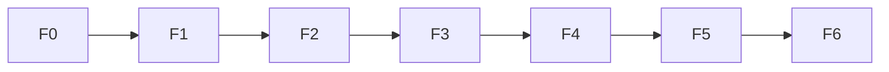

# HBM Demo 后续开发规划（PLAN2 · 本地可玩版）

**项目**：《HBM 显存价格保卫战》Web Demo — **前端 + 本地一键启动 + 联调**  
**前置条件**：后端 Phase 0–6 已完成（见 `PLAN.md`、`dev_logs/18_*`）  
**应用目录**：`agent_world/hbm_demo/`（后端）+ 新建 `agent_world/hbm_demo/web/`（前端）  
**设计参照**：`dev_logs/03_Web端Demo游玩形式与UI设计方案.md`、`dev_docs/1_story_prototype.md`、`dev_docs/2_architecture.md`  
**本版范围**：**仅本地开发可玩**；不含 Docker、Nginx、生产部署、CI、PR/Tag  

---

## 〇、最终交付标准（Definition of Done）

用户在**仓库根目录**执行**一行命令**：

```bash
./agent_world/hbm_demo/scripts/start_demo.sh
```

即可：

1. 自动启动 **Runner**（`run_hbm`）+ **Flask** + **前端 dev server**  
2. 浏览器打开 `http://localhost:5173`  
3. 点击「开始游戏」→ 输入台词 → 看到 **immediate_msg** → 轮询后看到 **F2F / RDC / GRP**  
4. Stats / Phase / Turn 正常更新；Turn 4 Bad End 与 Turn 25 结局页可触发  

**环境前提**（需事先安装，脚本不负责安装）：

| 依赖 | 版本 |
|------|------|
| Python | 3.10+，且已 `pip install -e .`（仓库根目录，见 §五 #4） |
| Node.js | 18+ |
| `DMXAPI_KEY` | 环境变量或 `agent_world/demo/.env` / `hbm_demo/.env` |

编码阶段注意事项见 **§五（6 条）**。

---

## 一、阶段总览

### 1.1 全项目阶段划分

| 区块 | 阶段 | 数量 | 状态 |
|------|------|------|------|
| 后端 | Phase 0–6 | 7 | ✅ 已完成 |
| 前端 + 本地集成 | **F0–F6** | **7** | ⬜ 待开发 |
| 可选增强 | F7+ | — | 不做也不影响本地可玩 |

### 1.2 PLAN2 执行顺序（严格线性）

```text
F0 前端脚手架
 → F1 API 层（Vite proxy，免 CORS）
 → F2 三屏 UI 壳
 → F3 游戏主循环（双段式 API）
 → F4 消息 / Stats / 结局 UI
 → F5 错误与 loading
 → F6 一行命令启动脚本 + 端到端验收
```

### 1.3 不在本 PLAN 范围

- Docker / docker-compose / Nginx / 云部署  
- GitHub Actions / pytest CI  
- PR 合并、Release Tag  
- `state_updates` 内心 OS 面板（F7+ 可选）  
- 修改 `agent_world/demo/` 与引擎核心  

---

## 二、技术栈（本地 only）

| 层级 | 技术 | 说明 |
|------|------|------|
| 前端框架 | React 18 + TypeScript + Vite 5 | SPA |
| 样式 | Tailwind CSS 或 CSS Modules | 三屏深色布局 |
| 状态 | Zustand 或 React Context | stats / messages / ui |
| HTTP | `fetch` + `credentials: 'include'` | Flask Session Cookie |
| 开发代理 | **Vite proxy `/api` → `:5000`** | **不走跨域，无需 CORS 补丁** |
| 轮询 | 1.5s 间隔，最多 120 次 | 对齐 Runner LLM 延迟 |
| 后端 | 已有 Flask + run_hbm | F6 由 shell 脚本拉起 |
| 启动 | **`scripts/start_demo.sh`** | 一行命令核心交付物 |

---

## 三、目录结构（目标）

```text
agent_world/hbm_demo/
  web/                          # F0 新建
    package.json
    vite.config.ts              # proxy /api → localhost:5000
    src/
      api/          client.ts, types.ts, hbm.ts
      store/        gameStore.ts
      components/   layout/, panels/, game/, screens/
      hooks/        useGameLoop.ts, useHealthCheck.ts
      constants/    places.ts, endings.ts
  scripts/
    start_demo.sh               # F6 核心 — 一行启动
    stop_demo.sh                # F6 可选 — 清理后台进程
  .env.example                  # DMXAPI_KEY 示例
  PLAN2.md
  README.md                     # F6 更新启动说明
```

**不包含** `docker/` 目录。

---

## 四、API 契约（与后端对齐，前端必实现）

前缀：`/api/hbm/simulations/hbm_memory_war/`（经 Vite proxy 转发）

| 函数 | 方法 | 路径 | 说明 |
|------|------|------|------|
| `getHealth()` | GET | `/health` | 200=就绪，503=Runner 未起 |
| `startSession()` | POST | `/session/start` | 新游戏 |
| `getSession()` | GET | `/session` | 恢复 stats/phase/turn |
| `postPlayerTurn()` | POST | `/player-turn` | 见下 |
| `getActionResult()` | GET | `/action-result?task_id=` | 轮询 |

**player-turn 请求体（固定）**：

```json
{
  "player_text": "用户输入",
  "tick_count": 8
}
```

> `tick_count: 8` 必须传，保证 API 2 在 NPC 无消息时仍能在 `start_tick+8` 兜底完成（见 dev_logs/18 B-1）。

**player-turn 响应三分支**：

| `data.status` | 前端行为 |
|---------------|----------|
| `processing` | 展示 `immediate_msg` → 轮询 `action-result` |
| `game_over` | Bad End 页，**不**轮询 |
| `completed` | Turn 25 结局页，**不**轮询 |

**player-turn 成功后 session 变化**：后端已将 `player_turn += 1`；轮询结束后须 `GET /session` 同步 UI。

完整 TypeScript 类型见附录 A。

---

## 五、实现注意事项（编码时必读）

以下 6 项**不阻塞**开发启动，但实现 F1–F6 时须对照，避免常见踩坑。

| # | 问题 | 建议 |
|---|------|------|
| 1 | F4 任务曾引用「§4.5」，正文已无该节 | **以 F4 内「Phase 过渡文案」表为准**，勿再引用 §4.5 |
| 2 | 附录 A 曾缺 `ActionResultProcessing`、`HealthData` | F1 实现 `types.ts` 时**对照 `routes.py` 与附录 A（已补全）** |
| 3 | 附录 D 仅验收 Turn 1 | DoD 是「本地能玩」；**通完 25 Turn 主线路**见可选 **F8 `PLAYTHROUGH.md`**，非 F6 必验项 |
| 4 | `start_demo.sh` 须在**仓库根**执行 | 脚本内 `cd` 到仓库根；启动前检查已执行 `pip install -e .`（见附录 C） |
| 5 | `player-turn` 可能耗时**数分钟** | `fetch` **勿设短 timeout**；后端 IPC 默认 `HBM_IPC_TIMEOUT=600` 秒 |
| 6 | 刷新页面后**聊天记录丢失** | Flask session **不持久化 messages**；MVP 可接受；可选 **F9 localStorage** 缓存 |

### 5.1 Session 与消息持久化（对应 #6）

Flask session 仅存 stats / phase / turn；**消息历史后端不持久**。

| 策略 | 做法 |
|------|------|
| MVP（默认） | 刷新后 stats 经 `GET /session` 恢复；聊天记录清空并提示用户 |
| 增强（F9） | `localStorage` 按 `task_id` 或局号缓存 messages |

### 5.2 HTTP 超时（对应 #5）

| 请求 | 建议 timeout |
|------|----------------|
| `GET /health`、`GET /session` | 10–30s |
| `POST /player-turn` | **不设上限**或 ≥ 600s（与 IPC inject 对齐） |
| `GET /action-result` | 30s（单次 poll；失败可继续下一轮 poll） |

---

## 六、开发阶段详解（F0–F6）

---

### Phase F0 — 前端工程初始化

**目标**：`npm run dev` 可打开空白页，API 请求经 proxy 打到 Flask。

| ID | 任务 |
|----|------|
| F0-1 | 在 `hbm_demo/` 下：`npm create vite@latest web -- --template react-ts` |
| F0-2 | `vite.config.ts`：`server.port=5173`，`proxy['/api'] → http://127.0.0.1:5000` |
| F0-3 | 全局 CSS：深色三栏基调 |
| F0-4 | `web/README.md`：`npm install` / `npm run dev` |

**验收**：

```bash
# 手动先起 Runner + Flask（见 hbm_demo/README.md）
cd agent_world/hbm_demo/web && npm run dev
# http://localhost:5173 无 Console 报错
```

---

### Phase F1 — API Client 层

**目标**：封装 5 个端点；**不修改 Flask CORS**（Vite proxy 同源）。

| ID | 任务 |
|----|------|
| F1-1 | `src/api/types.ts` — 附录 A 类型 |
| F1-2 | `src/api/client.ts` — `apiGet`/`apiPost`，`credentials:'include'`，解析 `{success,data,error}` |
| F1-3 | `src/api/hbm.ts` — 五个端点函数 |
| F1-4 | HTTP 错误映射：503→Runner 未就绪；504→IPC 超时；502→IPC 失败 |
| F1-5 | `postPlayerTurn` **不设短 timeout**（见 §五 #5、§5.2）；`getHealth` 503 时读 `success===false` 或 HTTP 503 |

**验收**（浏览器 Console 或临时 TestPage）：

```typescript
await getHealth();
await startSession();
await getSession(); // initialized: true
```

---

### Phase F2 — 三屏布局壳

**目标**：静态 UI，Mock 数据可渲染（参照 dev_logs/03）。

| ID | 任务 |
|----|------|
| F2-1 | `ThreeColumnLayout`：左 240px / 中 flex / 右 320px |
| F2-2 | `StatusPanel`：Vision / Execution / Trust / Burnout；Phase；Turn；地点 |
| F2-3 | `MainChat` + `PlayerInput` |
| F2-4 | `ObserverPanel`：Tab「私聊 RDC」「群聊 GRP」 |
| F2-5 | `BootScreen`、`LoadingOverlay` |
| F2-6 | `GameOverScreen`、`EndingScreen`（静态占位） |

**消息分工**：中屏仅 F2F；右屏 RDC+GRP；`sender=彭博终端` 高亮。

**验收**：Mock 数据渲染三屏，布局与 dev_logs/03 一致。

---

### Phase F3 — 游戏主循环（核心）

**目标**：Turn 1 完整跑通双段式流程。

| ID | 任务 |
|----|------|
| F3-1 | `useHealthCheck`：挂载 `GET /health`；503→BootScreen+重试 |
| F3-2 | 「开始游戏」→ `POST /session/start` → 写入 store |
| F3-3 | `useGameLoop.sendTurn(text)` — 见附录 B 伪代码 |
| F3-4 | 轮询：1500ms × 最多 120 次 |
| F3-5 | 完成后：`appendMessages` + `GET /session` 刷新 turn/phase |
| F3-6 | `immediate_msg` 斜体灰字展示 |
| F3-7 | `postPlayerTurn` 使用长 timeout / 无 timeout（§五 #5、§5.2） |

**验收**（Runner + Flask + `npm run dev` 三进程手动启动）：

1. 输入：「我的算法能把显存消耗降低 80%。」  
2. <2s 看到 immediate_msg  
3. 15–90s 内 action-result completed  
4. 中屏有 F2F 或空态提示；右屏可有 RDC  
5. Stats 数值变化  

---

### Phase F4 — 消息、Stats 与结局

**目标**：多 Turn 可玩；Bad End 与 Turn 25  UI 完整。

| ID | 任务 |
|----|------|
| F4-1 | `MessageBubble`：F2F 左 NPC / 右玩家；RDC 显示 sender→recipient |
| F4-2 | GRP 显示 group_id 100/200 标签 |
| F4-3 | 消息按 `attempted_at` 排序；auto-scroll |
| F4-4 | 发送前本地 push 玩家气泡 |
| F4-5 | Stats 变化动画；`player_turn / 25` |
| F4-6 | Phase 变化时 Toast 过渡文案（**下方 Phase 过渡文案表**，见 §五 #1） |
| F4-7 | `game_over` → GameOverScreen；`completed` → EndingScreen |
| F4-8 | 「重新开始」→ `session/start` + 清空 messages |

**Phase 过渡文案**：

| 节点 | 条件 | 文案 |
|------|------|------|
| A | Phase 1→2 | 前台带你进入私密会议室，Jensen 推门而入 |
| B | Phase 2→3 | Jensen 带你回到谈判室，三大 CEO 齐刷刷看向你 |
| C | Phase 3→4 | 三大 CEO 被请出，终局谈判开始 |

**验收**：Turn 1–3 连续游玩；Mock Turn 4 低分 → Bad End 页。

---

### Phase F5 — 错误处理与 loading

**目标**：Runner 挂掉、poll 超时不白屏。

| ID | 任务 |
|----|------|
| F5-1 | player-turn / poll 期间禁用输入 + 显示 elapsed 秒 |
| F5-2 | 503 Modal：复制 `run_hbm` 启动命令 |
| F5-3 | poll 120 次未完成：提示重试 |
| F5-4 | health 手动重试按钮 |
| F5-5 | 可选：Observer 底栏 `GET /env-status` 显示 current_tick |

**验收**：关掉 Runner → 前端友好报错；恢复后可继续。

---

### Phase F6 — 一行命令启动 + 端到端验收

**目标**：**本 PLAN 最终交付** — 单行脚本拉起全部进程。

| ID | 任务 |
|----|------|
| F6-1 | 编写 `scripts/start_demo.sh`（见附录 C） |
| F6-2 | 编写 `scripts/stop_demo.sh`（kill runner/flask/vite 子进程） |
| F6-3 | 编写 `.env.example` |
| F6-4 | 更新 `hbm_demo/README.md`：一行命令置顶 |
| F6-5 | 更新 `dev_logs/18_*` 标记 F 系列完成项 |
| F6-6 | **端到端验收清单**（附录 D）全部通过（Turn 1；25 Turn 见 §五 #3 / F8） |

**验收**：

```bash
cd /path/to/demo   # 仓库根
./agent_world/hbm_demo/scripts/start_demo.sh
# 自动打开或提示访问 http://localhost:5173
# Turn 1 可完整游玩
```

---

## 七、可选后端小改（建议 F3 前完成一项）

| ID | 任务 | 优先级 |
|----|------|--------|
| B-1 | 前端固定 `tick_count:8`（已在 §四约定） | 必须（前端侧） |
| B-2 | `game_service` 默认 `tick_count` 改为 8 | 可选，双保险 |
| B-3 | `check_action_complete` 在 `ipc_end_tick >= start+6` 且无消息时也 completed | 可选 |

**不做 B-2/B-3 也可玩**，只要前端始终传 `tick_count:8`。

---

## 八、可选扩展（F7+，本地可玩不依赖）

| 项 | 说明 |
|----|------|
| F7 | `state_updates` 内心 OS 面板 |
| F8 | `web/PLAYTHROUGH.md` 25 轮参考台词（**完整通关验证**，见 §五 #3） |
| F9 | localStorage 缓存聊天记录（刷新不丢，见 §5.1 #6） |
| F10 | Vitest 单测 |

---

## 九、依赖关系



F6 的 `start_demo.sh` 依赖 F0（web 存在）且联调时依赖 F3+（游戏可玩）。

---

## 十、工时估算（本地可玩）

| Phase | 工时 |
|-------|------|
| F0–F1 | 4h（含 §五 #2 类型补全、#5 长 timeout） |
| F2 | 5h |
| F3 | 6h |
| F4 | 6h |
| F5 | 3h |
| F6 | 3h |
| **合计** | **~27h（约 3–4 人日）** |

---

## 附录 A — TypeScript 类型

```typescript
export interface ApiResponse<T> {
  success: boolean;
  data?: T;
  error?: string;
}

export interface Stats {
  vision: number;
  execution: number;
  trust: number;
  burnout: number;
}

export interface GameMessage {
  sender: string;
  content: string;
  type: 'F2F' | 'RDC' | 'GRP';
  attempted_at?: number;
  recipient?: string;
  group_id?: number;
}

export interface HealthData {
  sim_dir: string;
  runner_ready: boolean;
  world_db_readable: boolean;
  ready: boolean;
  env_status?: Record<string, unknown>;
  db_error?: string | null;
}

export interface SessionSnapshot {
  initialized: boolean;
  sim_id?: string;
  runner_ready: boolean;
  place_id?: string;
  phase?: string;
  player_turn?: number;
  stats?: Stats;
  env_status?: Record<string, unknown>;
}

export interface PlayerTurnProcessing {
  status: 'processing';
  task_id: string;
  immediate_msg: string;
  stats_update: Stats;
  current_phase: string;
  start_tick: number;
  ipc_end_tick?: number;
}

export interface PlayerTurnGameOver {
  status: 'game_over';
  ending_id: 'bad_reject';
  public_messages: GameMessage[];
  stats_update: Stats;
}

export interface PlayerTurnCompleted {
  status: 'completed';
  ending_id: 'ending_join_nvidia' | 'ending_seed_round' | 'ending_cold_deal';
  stats_update: Stats;
  current_phase: string;
}

export interface ActionResultProcessing {
  status: 'processing';
  task_id: string;
  current_tick?: number;
  effective_tick?: number;
  start_tick?: number;
  ipc_end_tick?: number;
}

export interface ActionResultCompleted {
  status: 'completed';
  task_id: string;
  end_tick: number;
  public_messages: GameMessage[];
  observer_messages: GameMessage[];
  group_messages: GameMessage[];
  stats_update: Stats;
  current_phase: string;
}
```

---

## 附录 B — useGameLoop 伪代码

```typescript
async function sendTurn(playerText: string) {
  setLoading(true);
  pushLocalPlayerBubble(playerText);

  const { data } = await postPlayerTurn(playerText, { tick_count: 8 });

  if (data.status === 'game_over') { showBadEnd(data); return; }
  if (data.status === 'completed') { showEnding(data); return; }

  showImmediate(data.immediate_msg);
  updateStats(data.stats_update);

  for (let i = 0; i < 120; i++) {
    await sleep(1500);
    const ar = await getActionResult(data.task_id);
    if (ar.data?.status === 'completed') {
      appendMessages(ar.data);
      updateStats(ar.data.stats_update);
      await refreshSession();
      break;
    }
  }
  setLoading(false);
}
```

---

## 附录 C — start_demo.sh 规格

脚本路径：`agent_world/hbm_demo/scripts/start_demo.sh`  
运行位置：**仓库根目录**（用户从根执行；脚本内必须 `cd` 到仓库根，见 §五 #4）

**必须行为**：

0. `ROOT="$(cd "$(dirname "$0")/../../.." && pwd)"` 定位**仓库根**（`scripts/` → `hbm_demo/` → `agent_world/` → 根）；`cd "$ROOT"`  
1. 检测 Python、Node、`DMXAPI_KEY`；检测 `python -c "import agent_world"` 或提示先 `pip install -e .`  
2. 后台启动 Runner，轮询 `env_status.json` 直到 `status=running`  
3. 后台启动 Flask（`HBM_SIM_DIR` 指向 `hbm_demo/sim/hbm_memory_war/`）  
4. 轮询 `GET http://127.0.0.1:5000/api/hbm/simulations/hbm_memory_war/health` 直到 200  
5. 前台启动 `cd agent_world/hbm_demo/web && npm run dev`（若 `node_modules` 不存在则先 `npm install`）  
6. `trap` 捕获 EXIT/INT/TERM，调用 `stop_demo.sh` 清理  

**环境变量（脚本内 export）**：

```bash
export HBM_SIM_DIR="${ROOT}/agent_world/hbm_demo/sim/hbm_memory_war"
export FLASK_APP=agent_world.app:create_app
export FLASK_RUN_PORT=5000
```

**用户看到**：

```text
HBM Demo 已启动
  Runner : OK
  Flask  : http://127.0.0.1:5000
  前端   : http://localhost:5173
按 Ctrl+C 停止全部进程
```

---

## 附录 D — F6 端到端验收清单

> **范围说明（§五 #3）**：本清单验证「本地一行命令 + Turn 1 可玩」，**不要求**在此阶段通完 25 Turn。完整主线路试玩见可选 **F8 `PLAYTHROUGH.md`**。

| # | 操作 | 期望 |
|---|------|------|
| E1 | 在**仓库根**执行 `./agent_world/hbm_demo/scripts/start_demo.sh` | 三进程启动，无报错 |
| E2 | 打开 localhost:5173 | BootScreen → 开始游戏 |
| E3 | Turn 1 发送台词 | immediate_msg + 轮询 completed（允许 15–90s） |
| E4 | 中屏 F2F / 右屏 RDC 或 GRP | 至少一类有内容或空态提示 |
| E5 | Stats 变化 | vision/execution 增加 |
| E6 | 刷新页面 | stats 可经 session 恢复；messages 可清空（§5.1，或 F9 增强） |
| E7 | Ctrl+C 停止 | 进程全部退出 |
| E8 | 再执行 start_demo.sh | 可重复启动 |

---

## 附录 E — 相关文档

| 文档 | 用途 |
|------|------|
| `PLAN.md` | 后端 Phase 0–6（已完成） |
| `README.md` | 手动分进程启动（脚本失败时 fallback） |
| `dev_logs/18_*` | 待办与已知问题 |
| `dev_logs/03_*` | 三屏 UI 设计 |
| `dev_docs/2_architecture.md` | API 与 Stats 规则 |

---

*PLAN2 版本：2026-05-23 · 本地可玩版（含 §五 实现注意事项）*
