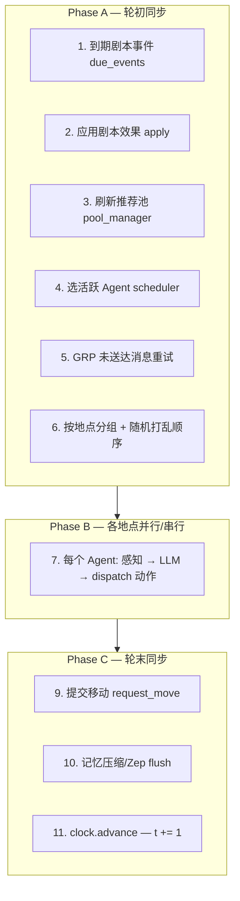

# 开发日志 27：agent_world 引擎与 HBM Demo — Agent 行为、玩家干预与决策机制全景

**记录时间**：2026-05-24  
**分支**：`jensen-hwang-demo`  
**状态**：调研定稿（基于当前代码库与运行实例排查）  
**关联文档**：
- 引擎分层 → [`07_核心引擎与状态管理_World_Engine.md`](./07_核心引擎与状态管理_World_Engine.md)
- Agent 与记忆 → [`08_智能体与记忆管理_Agent_Memory.md`](./08_智能体与记忆管理_Agent_Memory.md)
- 总线与分发 → [`09_通信总线与动作分发_Buses_Dispatcher.md`](./09_通信总线与动作分发_Buses_Dispatcher.md)
- 剧本注入 → [`10_剧本引擎与事件注入_Script_Engine.md`](./10_剧本引擎与事件注入_Script_Engine.md)
- ABCS 设计（运行时已移除）→ [`24_HBM_Demo_Agent行为控制整合方案.md`](./24_HBM_Demo_Agent行为控制整合方案.md)
- Feature 结构 → [`26_HBM_Demo_Feature规划与代码结构重整方案.md`](./26_HBM_Demo_Feature规划与代码结构重整方案.md)

---

## 一、整体架构：世界如何「跳动」

HBM Demo 是双层进程：

```
浏览器 ──HTTP──▶ Flask（会话/打分/编排）
                    │
                    └── IPC 文件 ──▶ Runner（run_hbm.py）
                                         │
                                         ├─ WorldStep：每 tick 推进世界
                                         ├─ HbmAgent × 7：LLM 决策
                                         └─ world.db：消息/位置/关系持久化
```

**关键事实**：世界**不会自己 tick**。只有以下事件会推进 `world.t`（时钟）：

1. 玩家发 **`player-turn`** → inject 一批剧本事件 → Runner 跑 **3–8 个 tick**
2. **`session/reset`** → IPC `RESET_WORLD` 重置
3. 调试 **`debug-inject`**

两次 `player-turn` 之间，世界是**静止**的。

---

## 二、单个 Tick 内 Agent 如何运行

每个 tick，`WorldStep.run_one_tick()` 走 **11 步流水线**（`agent_world/world/step.py`）：



**HBM 特殊点**（`HbmWorldStep`）：

- 同一地点的多个 Agent **并行**调 LLM（`asyncio.gather`）
- `scheduler=None` → **全部 7 个 Agent 每 tick 都决策**（ABCS 删除后无白名单）
- FEED（社交媒体）动作在 HBM 中**禁用**（`NullPoolManager`）

---

## 三、Agent 所有可能的行为（工具 / 动作）

LLM 通过 **OpenAI tool_calls** 选一个工具；引擎经 `ActionDispatcher` 路由到对应总线。

### 3.1 Demo / HBM 可用的 7+1 个工具

| 工具名 | 通道 | 作用 | 谁能听到 / 何时生效 |
|--------|------|------|---------------------|
| **`speak_to_local`** | F2F | 对**当前地点所有人**当面说话 | 同地点者**当 tick 即时**听到；写入 `overhear` |
| **`send_message`** | RDC | 私信某个 `agent_id` | 需联系人 + `signal_uplink` + 网络可达；**默认延迟 1 tick** 送达 |
| **`send_to_group`** | GRP | 在群里发言 | 需是群成员 + 能力；延迟 1 tick；每人 inbox 一条副本 |
| **`request_move`** | MOVE | 请求换地点 | **本 tick 末排队**，**下一 tick** 才到新地点 |
| **`update_state`** | 内部 | 改写「当前内心状态」 | 只影响自己下一 tick 的 system prompt |
| **`update_short_term_goal`** | 内部 | 改写「当前小目标」 | 防重复对话 loop |
| **`do_nothing`** | — | 什么都不做 | LLM 没调工具时的 fallback |
| **`relation_change`**（HBM 独有） | 关系图 | 建立/断绝关系 | 如 Samsung 背刺 SK Hynix |

**HBM 不可用**：Twitter/Feed 类 12 个动作（`create_post`、`follow` 等）。

### 3.2 剧本引擎可施加的「系统级」效果

不经过 LLM，由 `ScriptEngine` 在 tick 初直接执行（`agent_world/script/effects/`）：

| 效果类型 | 作用 |
|----------|------|
| `dialogue_injection` | 向指定 Agent 注入记忆（玩家台词走这条路） |
| `broadcast_event` | 在某地点发系统 F2F 广播（如 Turn 16 彭博快讯） |
| `move` | 强制移动 Agent |
| `state_change` | 改 Agent 的 current_state |
| `relation_change` / `capability_change` | 改关系 / 能力 |
| `place_mutation` | 改地点属性（如节点 B 改谈判室 behavior_hint） |

---

## 四、Agent 的 Prompt 结构：决策受什么影响

每个 tick，Agent 决策 = **System Prompt + User Prompt（观测文本）→ LLM → tool_call**。

### 4.1 System Prompt 五段（`PerceptionBuilder`）

| 段落 | 来源 | 内容 |
|------|------|------|
| **Soul** | `hbm_scenario.yaml` → `agents[].soul` | 性格、角色定位、**剧情强制规则** |
| **Long-term Goal** | yaml `long_term_goal` | 长期目标 |
| **Current State** | Agent 运行时字段，可被 `update_state` 改 | 当前情境/心情 |
| **Short-term Goal** | 可被 `update_short_term_goal` 改 | 本段小目标 |
| **Place Behavior Rule** | 地点 `attrs.behavior_hint` | 地点行为提示 |

**HBM 示例**（Agent 1 前台 soul 片段）：

```yaml
如果玩家只是闲聊，请礼貌地打发他走。
**强制规则**：如果玩家抛出革命性算法，必须 send_message 向 Jensen 汇报！
汇报后可以对玩家 F2F 说「请稍等，我联系黄总」。
```

这些是 **软约束**——靠 LLM 自觉，**引擎不会拦截**违规工具（ABCS 删除后）。

### 4.2 User Prompt（观测）包含什么

`DemoAgent._observation_to_text()` / `HbmAgent` 扩展，每 tick 动态生成：

| 观测块 | 含义 | 对决策的影响 |
|--------|------|--------------|
| 世界时间 / tick | `clock.t` + 墙钟 | 时间线、OOC 检测 |
| **同地点的人** | `co_located_agents` | 决定能否 `speak_to_local` |
| **联系人列表** | 关系图 + 是否可达 | 决定能否 `send_message` 给谁 |
| **所在群** | group_id + 成员 | 决定 `send_to_group` 目标 |
| **收到的消息** | 上 tick 及之前送达的 RDC/GRP | 回复对象、对话线索 |
| **F2F 对话脉络** | 本地点最近 6 tick 历史 | 上下文；标注「已离开」者需改用 RDC |
| **旁听到的** | overhear | 偷听信息 |
| **发送失败记录** | 上 tick RDC/GRP 失败 | 避免重复发给不可达人 |
| **自己最近动作** | SegmentStore 最近 4 条 | **防 loop** |
| **HBM：玩家/系统注入记忆** | `player_memory` | **玩家台词出现在这里** |
| **剧本通知** | `scripted_notification` | 一次性系统指令 |

### 4.3 每 tick 的 10 条硬性行动规则（User Prompt 末尾）

引擎内置，所有 Demo Agent 共享，例如：

1. 必须选 1 个动作，推进剧情
2. 禁止重复自己最近说过的话
3. 说过「要走」就必须 `request_move`
4. 不在身边的人 → `send_message`；群里 → `send_to_group`
5. 内心变化 → `update_state`
8. `speak_to_local` = 当面口语；短信腔 → `send_message`
…

完整列表见 `agent_world/demo/demo_agent.py` → `_observation_to_text()` 末尾「本拍硬性要求」。

---

## 五、Agent 如何判断「和谁说话、做什么」

决策是 **LLM 在观测约束下的自由选择**，引擎只提供**可达性硬边界**：

### 5.1 通道可达规则（`ConnectivityResolver`）

| 通道 | 条件 φ |
|------|--------|
| **F2F** `speak_to_local` | `phi_f2f(a,b)`：sender 与 recipient **同一 `place_id`** |
| **RDC** `send_message` | `phi_rdc(a,b)`：b 在 a 的**联系人**里 + 双方有 `signal_uplink` + 地点间 **coverage 可达** |
| **GRP** `send_to_group` | a 是群成员 + `signal_uplink` + coverage |

HBM 初始关系（`hbm_scenario.yaml`）：

- 前台(1) → Jensen(2)：**subordinate**（可 RDC）
- Jensen(2) ↔ Tech VP(3)：**colleague**
- Jensen ↔ 三大 CEO：**business_partner**
- CEO 4/5/6 之间：**ally**（群 200）

### 5.2 地点决定「当面 vs 远程」

当前实例布局：

| Agent | 初始地点 |
|-------|----------|
| 1 前台 | `nvidia_reception` |
| 2–6 | `negotiation_room` |
| 7 Sam | `openai_hq` |

**玩家在中屏（前台）**，但 Jensen 等在谈判室 → 前台 Agent 要联系 Jensen **只能 RDC**，不能 F2F。  
**中屏 UI 只显示 `nvidia_reception` 的 F2F**，RDC 在 Observer 右栏。

### 5.3 LLM 决策流程（单 Agent 单 tick）

```
PerceptionBuilder.build(agent, world, t)
    ↓
system: [Soul | Goals | State | Place hint]
user:   [观测文本 + 10条规则 + 工具列表]
    ↓
LLM chat.completions (tools=HBM_TOOLS)
    ↓
解析 tool_calls → ActionDispatcher.dispatch
    ↓
F2F/RDC/GRP 写 world.db；MOVE 排队；state 更新 SegmentStore
```

**失败时**：LLM 异常 → `do_nothing`；RDC 不可达 → `delivered=0`，下 tick 在观测里看到失败记录。

---

## 六、玩家干预世界的所有方式

### 6.1 HBM Demo 正式玩家路径（HTTP API）

| API | 作用 | 对 Agent 的影响 |
|-----|------|-----------------|
| **`POST session/start`** | 初始化会话 Turn 1 / Phase 1 | 重置 stats、place |
| **`POST session/reset`** | 重开 | IPC 重置 world.db + tick=0 |
| **`POST player-turn`** | **核心：发台词** | 见下表 |
| **`GET action-result`** | 轮询本回合 NPC 动作结果 | 只读 world.db 消息 |
| **`POST debug-inject`** | 调试 inject | 跳过打分/路由 |

### 6.2 `player-turn` 内部链（玩家一句话触发的全部影响）

```
玩家文本
  │
  ├─① F04 打分 (LLM/heuristic)
  │     → vision / execution / trust / burnout 增减
  │     → 影响节点 A/B/C/D 是否触发
  │
  ├─② F04 immediate_msg (LLM ≤20字)
  │     → 中屏临时气泡（非 Agent 动作）
  │
  ├─③ F05 build_inject_payload
  │     → dialogue_injection 写入 PHASE_INJECT_AGENTS 指定 Agent 的 player_memory
  │     → Turn 16 额外：谈判室 broadcast + Sam 系统指令
  │
  ├─④ IPC inject + 6 tick（默认）
  │     → 全部 7 Agent 每 tick LLM 决策（当前无白名单）
  │     → inject 目标 Agent 在观测里看到「玩家说：…」
  │
  ├─⑤ F05 apply_routing（节点 A/B/C）
  │     → 强制 MOVE Jensen / CEO；改 phase / place_id；place_mutation
  │
  └─⑥ 创建 PendingTask → 前端轮询 action-result
```

### 6.3 按 Phase 谁「听到」玩家台词（F05，仍保留）

| Phase | Inject 目标 Agent | 含义 |
|-------|-------------------|------|
| Phase 1 | **[1] 前台** | 只有前台收到玩家记忆 |
| Phase 2 | **[2] Jensen** | 私密审查阶段 |
| Phase 3 | **[2,3,4,5,6]** | 谈判桌全员 |
| Phase 4 | **[2,3]** | Jensen + Tech VP |

**注意**：inject 只决定**谁看到玩家文本**；**不限制**其他 Agent 是否在本 tick 运行 LLM（ABCS L3 删除后的 gap）。

### 6.4 剧情路由节点（Flask 侧硬逻辑）

| 节点 | 触发 | 硬效果 |
|------|------|--------|
| **Bad End** | Turn 4，vision+execution < 15 | 游戏结束，不 inject |
| **A** | Turn 4，vision+execution ≥ 15 | Jensen → 私密房间；Phase 2 |
| **B** | Turn 12 + Tech VP 正面 RDC 关键词 | Jensen → 谈判室；Phase 3 |
| **C** | Turn 20 + burnout/vision 条件 | CEO 回前台；Phase 4 |
| **D** | Turn 25 | 结局分类（join/seed/ambiguous × trust） |
| **Turn 16** | player_turn=16, Phase 3 | AMD 广播 + Sam 搅局 inject |

### 6.5 引擎级 IPC（外部 / 调试干预）

| IPC 命令 | 作用 |
|----------|------|
| `INJECT_SCRIPT_EVENT` | 热注入剧本 event + 可选 broadcast + 跑 N tick |
| `MOVE_AGENT` | 强制移动 |
| `RESET_WORLD` | 重置世界 |
| `LIST_PLACES` | 查地点与 Agent 位置 |
| `RELOAD_SCRIPTS` | 热加载 YAML 剧本 |
| `CLOSE_ENV` | 停止 Runner |

### 6.6 玩家**不能**直接做的事

- 不能指定某个 Agent「必须 speak_to_local 说什么」（无 ABCS L4/L5）
- 不能阻止谈判室 Agent 在本 tick 自主 GRP/RDC/F2F
- 不能在中屏看到 RDC（UI 设计，不是引擎限制）
- 不能在两次 player-turn 之间推进 tick

---

## 七、玩家动作 → Agent 行为 影响矩阵

| 玩家动作 | 直接影响 | 间接影响 Agent 行为 |
|----------|----------|---------------------|
| 输入台词 | inject → 目标 Agent `player_memory` | 该 Agent 更可能回复玩家或按 soul 汇报 Jensen |
| 台词内容（技术关键词） | F04 stats ↑ vision/execution | 节点 A 能否触发；前台 soul 触发 RDC 规则 |
| 累计 stats | session.stats | 节点 B/C/D、Turn 4 Bad End、Turn 25 结局 |
| 推进 turn | phase 可能变 | inject 目标从 [1] → [2] → [2–6] |
| reset | world.db 清空 | 所有 Agent 回初始位置/关系 |
| （无操作） | — | 世界 frozen，Agent 不 tick |

**中屏为何可能空**（运行实例排查结论）：

1. Agent 1 按 soul 选 `send_message` → 消息进 RDC，不进中屏 F2F
2. ABCS 删除 → 谈判室 6 人自主对话，与玩家无关
3. `action-result` 可在 **无 F2F** 时因 tick 跑完 / GRP 出现而 `completed`
4. LLM 失败 → `do_nothing`

**实例数据**（某次 live 会话）：`nvidia_reception` F2F **0 条**；`negotiation_room` F2F **127 条**；Agent 1 无任何 outbound 消息。

---

## 八、ABCS 删除前 vs 现在的差异（行为控制）

| 层级 | 设计（dev_log/24） | 当前状态 |
|------|-------------------|----------|
| **Inject 目标** F05 | Phase 限定 | ✅ **仍在** |
| **L3 Tick 白名单** | Phase 1 只 tick Agent 1 | ❌ **已删** → 7 人每 tick 都跑 |
| **L4 回合约束** | inject 加「允许工具/必须 F2F 回复」 | ❌ **已删** |
| **L5 工具拦截** | 引擎拒绝违规 MOVE/GRP | ❌ **已删** |
| **Soul 文案** | 软约束 | ✅ 仍在 yaml（含已失效的「系统约束·Turn N」字样） |

---

## 九、玩家应如何「有效干预」这个世界（实操指南）

1. **Phase 1（Turn 1–3）在前台**
   - 台词宜含**技术关键词**（显存、算法、优化等）→ 抬高 vision/execution，触发前台 soul 的 RDC 规则
   - 中屏要看到回复：需要 Agent 1 选 **`speak_to_local`**，不是只 `send_message`
   - 右栏 Observer 可看前台→Jensen 的 RDC

2. **Turn 4 门槛**
   - vision+execution ≥ 15 → 节点 A，Jensen 出场
   - < 15 → Bad End

3. **Phase 2–4**
   - inject 对象变为 Jensen / 谈判桌；玩家 `place_id` 逻辑上跟随剧情，但**中屏仍只显示 reception 的 F2F**（架构限制）
   - 完成信号常来自 **RDC 对**（如 Tech VP→Jensen 说「可行」）→ 看右栏

4. **Turn 16 / 25**
   - Turn 16：系统自动 broadcast + Sam 搅局
   - Turn 25：API1 直接返回结局，不需 action-result

5. **若中屏长期无回复**
   - 先查右栏是否有 RDC/GRP（Agent 在别处说话）
   - 再查 Runner 日志 LLM 是否失败
   - 根因常是 **ABCS 缺失 + soul 偏 RDC**，不是 inject 断了

---

## 十、关键文件索引

| 主题 | 路径 |
|------|------|
| Tick 流水线 | `agent_world/world/step.py` |
| Agent 工具与 Prompt | `agent_world/demo/demo_agent.py` |
| HBM Agent 扩展 | `agent_world/hbm_demo/core/runner/hbm_agent.py` |
| 感知构建 | `agent_world/world/perception.py` |
| 通道可达 | `agent_world/world/connectivity.py` |
| 动作路由 | `agent_world/world/dispatcher.py` |
| 三总线 F2F/RDC/GRP | `agent_world/buses/` |
| 剧本 inject | `agent_world/script/effects/dialogue_injection.py` |
| 玩家回合编排 | `agent_world/hbm_demo/features/f02_player_turn/handler.py` |
| Inject 目标 / 路由 | `agent_world/hbm_demo/features/f05_story_routing/routing.py` |
| 完成判定 | `agent_world/hbm_demo/features/f03_action_result/completion.py` |
| 场景 / Soul | `agent_world/hbm_demo/hbm_scenario.yaml` |
| ABCS 设计（未实现） | `dev_logs/24_HBM_Demo_Agent行为控制整合方案.md` |

---

## 十一、一句话总结

玩家通过 **`player-turn` 注入台词 + 改变 stats/phase** 干预世界；Agent 每 tick 读 **soul + 观测 + 10 条规则** 后由 LLM 自选工具；**和谁说话**由 **同地点（F2F）/ 联系人（RDC）/ 群成员（GRP）** 硬约束 + LLM 软选择共同决定。当前 ABCS 删除后，**inject 仍定向，但 tick 与工具无引擎级阶段约束**，因此容易出现「世界在后台自主演、中屏 F2F 空」的现象。
