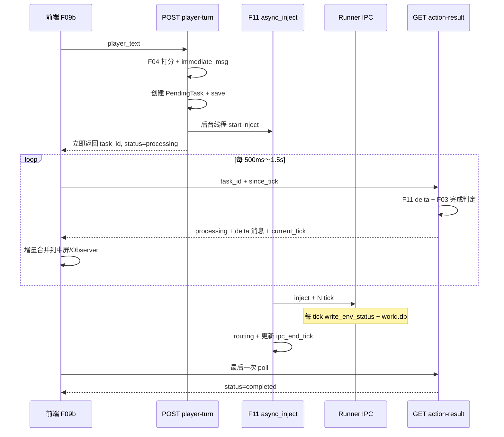

# 开发日志 28：HBM Demo F11 — 回合内增量同步（Live Turn Sync）

**记录时间**：2026-05-24  
**分支**：`feature/f11-live-turn-sync`（自 `jensen-hwang-demo` 拉出）  
**状态**：方案定稿 · 待实施  
**Feature ID**：**F11 — Live Turn Sync（回合内增量同步）**  
**依据来源**：
- 引擎与 tick 机制 → [`27_agent_world引擎与HBM_Demo_Agent行为与玩家干预机制全景.md`](./27_agent_world引擎与HBM_Demo_Agent行为与玩家干预机制全景.md)
- Feature 规划与目录规范 → [`26_HBM_Demo_Feature规划与代码结构重整方案.md`](./26_HBM_Demo_Feature规划与代码结构重整方案.md)
- ABCS 设计（后续 Feature）→ [`24_HBM_Demo_Agent行为控制整合方案.md`](./24_HBM_Demo_Agent行为控制整合方案.md)

---

## 1. 背景与问题

### 1.1 用户期望

> 后台世界每更新一个 tick，前端就能够立即进行更新，而不是等到最后世界停止了才统一更新。

### 1.2 当前实际行为

```
玩家输入 → POST player-turn（阻塞 30s～数分钟）
         → IPC inject 跑完 3–8 tick
         → 才返回 task_id
         → 前端才开始轮询 action-result
         → status=completed 时一次性 APPEND 全部消息
```

**症状**：
- Observer 底栏 tick 数字在 inject 期间可能已在变（`env-status` 5s 轮询），但中屏/右栏**无新消息**；
- `LoadingOverlay` 覆盖全屏，玩家长时间看不到 Agent 回复；
- 与 dev_log/27 排查的「tick 不动」不同类问题——后者是 Runner/API 挂起；本问题是 **同步模型设计** 导致的体验缺口。

### 1.3 与 ABCS（F07）的关系

| 维度 | F11 Live Turn Sync | F07 ABCS |
|------|-------------------|----------|
| 目标 | 每 tick 增量展示已有消息 | 减少「不该出现」的消息 |
| 依赖 | 不依赖 ABCS | 不依赖 F11，但 F11 完成后 ABCS 收益更清晰 |
| 实施顺序 | **先做** | F11 合并后再开 `feature/f07-agent-behavior-control` |

---

## 2. 可行性分析

### 2.1 结论：**可行，Runner 侧基本就绪**

| 维度 | 结论 | 说明 |
|------|------|------|
| Runner 每 tick 落库 | ✅ 已具备 | `ipc_handlers.py` 每 tick 调用 `write_env_status` + `world_step.run_one_tick()`，消息写入 `world.db` |
| Flask 读 mid-inject 的 world.db | ✅ 可行 | F06 `ReadOnlyWorldDB` 已有只读 + lock retry |
| 前端逐 tick 展示消息 | ✅ 可行 | 需 API 增量契约 + store 去重合并 |
| 最大阻塞点 | ⚠️ `player-turn` 同步等 IPC | **必须改为「先返回 task，后台 inject」** |
| Flask 开发服务器单线程 | ⚠️ 需注意 | inject 放后台线程；GET 轮询与 POST 可并行 |
| 引擎核心 | ✅ 不必改 | `WorldStep`、Agent、总线、IPC 协议均不变 |

### 2.2 已有基础设施（代码锚点）

**Runner 每 tick 写 env_status**（`core/runner/ipc_handlers.py`）：

```python
for _ in range(tick_loops):
    await world_step.run_one_tick()
    write_env_status(sim_dir_str, get_current_tick())
```

**F02 当前同步阻塞 inject**（`features/f02_player_turn/handler.py`）：

```python
resp = send_inject_batch(ipc_client, events=events, ...)
# ... routing ...
save_task(...)
return {"status": "processing", "task_id": task_id, ...}
```

`send_inject_batch` 在 HTTP 请求线程内阻塞至 inject 批次全部 tick 跑完。

**F03 processing 时不返回消息**（`features/f03_action_result/handler.py`）：

```python
if not check_action_complete(task, effective_tick, db):
    return {
        "status": "processing",
        "task_id": task_id,
        "current_tick": env_tick,
        ...
        # 无 public_messages / observer_messages
    }
```

**前端仅在 completed 时合并**（`web/src/features/game-loop/useGameLoop.ts`）：

```typescript
const response = await postPlayerTurn({ player_text: trimmed });
// ... player-turn 返回后才开始 poll ...
if (isCompletedAction(poll.data)) {
  dispatch({ type: "APPEND_ACTION_RESULT", data: poll.data });
}
```

**缺口归纳**：不在 Runner，而在 **Flask 阻塞 + API2 只在 completed 吐消息 + 前端只在 completed 合并 UI**。

---

## 3. Feature 定位

### 3.1 命名与 ID

| 项 | 值 |
|----|-----|
| Feature ID | **F11** |
| 英文名 | Live Turn Sync |
| 中文名 | 回合内增量同步 |
| Git 分支 | `feature/f11-live-turn-sync` |
| 目录 | `agent_world/hbm_demo/features/f11_live_turn_sync/` |

**为何不用 F07**：dev_log/24 / dev_log/26 已将 **F07 保留给 ABCS**；本需求是 API/前端同步模型，独立 Feature 便于分 PR、独立回滚。

### 3.2 是否在 `features/` 下新建文件夹？

**是。** 理由：

1. 跨 F02 / F03 / F08 / F09，需要 **编排层 + 契约**（异步 inject、增量 delta、任务状态机）；
2. 符合 dev_log/26「可独立合并的最小能力单元」；
3. F03 保留「完成判定」语义；F11 负责「processing 阶段增量吐数」，职责清晰。

### 3.3 产品验收约束（对齐 dev_log/26 §1.2）

1. **验证引擎能力**：Tick 推进、IPC inject、world.db 只读、Flask 异步编排；
2. **不过度游戏化**：仅改善「对话出现时机」，不新增玩法规则；
3. **可独立回滚**：F11 模块 + F02/F03 调用点可 revert，不影响 Runner。

---

## 4. 目标架构

### 4.1 时序图



### 4.2 与现状对比

| 环节 | 现状 | F11 目标 |
|------|------|----------|
| `POST player-turn` | 阻塞至 inject 结束 | 打分后立即返回 `task_id` |
| inject + routing | 请求线程同步 | F11 后台线程 |
| `GET action-result` processing | 仅 tick 元数据 | 含 `delta` 增量消息 |
| 前端 poll 时机 | player-turn 返回后 | 同上，但 processing 即有内容 |
| 前端 store | `APPEND_ACTION_RESULT` 仅 completed | 新增 `APPEND_TURN_DELTA` |
| Runner | 每 tick 写库 | **不改** |

---

## 5. API 契约设计

### 5.1 `POST /player-turn`（F02 改造，F11 编排）

#### 同步部分（仍在 HTTP 请求线程）

1. F04 打分、`apply_stat_deltas`、Turn 4 Bad End 早退；
2. `generate_immediate_msg`；
3. `build_inject_events`；
4. 创建 `PendingTask`（`ipc_end_tick=None`，`inject_status="running"`）；
5. **`save_task` + 持久化 session**（stats 已更新；`player_turn` 仍待 inject 成功后 +1，与现逻辑一致）；
6. 调用 F11 `start_background_turn(...)` 启动后台线程；
7. **立即返回**（不再调用阻塞式 `send_inject_batch`）。

#### 后台线程（F11）

1. `send_inject_batch` → 等待 Runner 跑完 N tick；
2. 读取 `ipc_result.end_tick`，更新 task.`ipc_end_tick`；
3. `routing.apply_routing(...)`（顺序与现 F02 一致：inject 完成后才 routing）；
4. `hbm.player_turn += 1`，`save_session`；
5. 设置 `inject_status="done"`（失败则 `"failed"` + 错误信息）。

#### 响应（Turn 1–24，异步路径）

```json
{
  "status": "processing",
  "task_id": "task_xxxxxxxxxxxx",
  "immediate_msg": "...",
  "stats_update": { "trust": 50, "..." : "..." },
  "current_phase": "Phase 1",
  "start_tick": 0,
  "player_turn": 1
}
```

**特殊路径（保持同步，不走 F11）**：

| 场景 | 行为 |
|------|------|
| Turn 25 / 终局 | 现有同步逻辑 + `status: completed` + `ending_id` |
| Turn 4 Bad End | 现有 `status: game_over` |
| `debug-inject` | 保持现有调试 API，可后续再异步化 |

### 5.2 `GET /action-result`（F03 扩展 + F11 delta）

#### 新增 Query 参数

| 参数 | 类型 | 默认 | 含义 |
|------|------|------|------|
| `task_id` | string | 必填 | 不变 |
| `place_id` | string | 可选 | 不变（task 权威优先） |
| `since_tick` | int | `task.start_tick` | 客户端已消费的最大 tick |

#### `status: processing` 响应（新增 `delta`）

```json
{
  "status": "processing",
  "task_id": "task_xxxxxxxxxxxx",
  "current_tick": 4,
  "effective_tick": 4,
  "start_tick": 0,
  "ipc_end_tick": null,
  "inject_status": "running",
  "delta": {
    "public_messages": [
      { "sender": "接待前台", "content": "...", "type": "F2F", "attempted_at": 3 }
    ],
    "observer_messages": [
      { "sender": "Tech VP", "content": "...", "type": "RDC", "recipient": "Jensen", "attempted_at": 2 }
    ],
    "group_messages": [],
    "through_tick": 4
  }
}
```

#### `status: completed` 响应

保持现有字段（`public_messages`、`observer_messages`、`group_messages`、`stats_update` 等）。  
可选：`delta` 省略，或提供最后一档补漏（`since_tick` 至 `effective_tick`）。

#### `inject_status: failed` 响应

```json
{
  "status": "error",
  "task_id": "task_xxxxxxxxxxxx",
  "inject_status": "failed",
  "error": "IPC inject timeout or runner error: ..."
}
```

### 5.3 `GET /env-status`（可选增强）

Runner 已在每 tick 更新 `current_tick`。F11 主路径可 **直接用 action-result 的 `current_tick` 驱动 Observer**，将 `useEnvStatus` 轮询间隔从 5s 降至 1s 或与 game-loop poll 联动；**非必须改 env-status 响应格式**。

---

## 6. 数据模型扩展

### 6.1 `PendingTask` 扩展（`features/f02_player_turn/task.py`）

```python
@dataclass
class PendingTask:
    task_id: str
    start_tick: int
    place_id: str
    phase: str
    player_turn: int
    ipc_end_tick: Optional[int] = None
    inject_status: str = "pending"   # pending | running | done | failed
    inject_error: Optional[str] = None
```

### 6.2 完成判定调整（`features/f03_action_result/completion.py`）

`check_action_complete` 中 **inject 未完成时不应仅因 `ipc_end_tick` 误判完成**：

```python
# 伪代码
if task.inject_status not in ("done", None):
    # inject 仍在跑：仅消息触达或 tick 上限可提前完成
    if db.has_f2f_after(...) or db.has_rdc_pair_after(...) or db.has_grp_after(...):
        return True
    if current_tick >= start + 8:
        return True
    return False

# inject 已完成：保留现有 ipc_end_tick 兜底逻辑
if task.ipc_end_tick is not None and current_tick >= task.ipc_end_tick:
    return True
```

---

## 7. 模块与目录结构

### 7.1 新建 — F11

```text
agent_world/hbm_demo/features/f11_live_turn_sync/
├── __init__.py
├── async_inject.py      # 后台 inject + routing 收尾 + 更新 task/session
├── delta.py             # build_turn_delta(task, since_tick, db) → delta dict
├── task_state.py        # inject_status 常量、task 更新 helper
└── handler.py           # start_background_turn(...) 入口，供 F02 调用
```

| 模块 | 职责 |
|------|------|
| `handler.py` | 接收 flask app、session、task、inject 参数；启动 daemon 线程 |
| `async_inject.py` | 线程内：`send_inject_batch` → 更新 ipc_end_tick → `routing.apply_routing` → player_turn++ |
| `delta.py` | 封装 F06 查询：`fetch_f2f_history_at`、`fetch_messages_since`，输出格式化 delta |
| `task_state.py` | 线程安全地 `load_task` / `save_task`；状态机转换 |

### 7.2 修改 — 后端

| 模块 | 文件 | 改动要点 |
|------|------|----------|
| F02 | `features/f02_player_turn/handler.py` | Turn 1–24 走 F11 异步；Turn 25/Bad End 保持同步 |
| F02 | `features/f02_player_turn/task.py` | 扩展 `inject_status` / `inject_error` |
| F03 | `features/f03_action_result/handler.py` | processing 分支调用 F11 `build_turn_delta` |
| F03 | `features/f03_action_result/completion.py` | inject 未完成时的完成判定（§6.2） |
| F06 | `features/f06_read_model/world_db.py` | 可选：`fetch_messages_after_tick(since_t, t_now)` 便捷封装 |
| F08 | `http/routes.py` | `action-result` 增加 `since_tick` query |
| F08 | `game_service.py` | re-export F11 入口（若需要） |
| Registry | `features/__init__.py` | 注册 F11 |
| 测试 | `scripts/test_m0_acceptance.py` | 断言 processing 阶段 delta 非空、tick 递增 |

### 7.3 修改 — 前端（F09b 为主）

| 文件 | 改动要点 |
|------|----------|
| `web/src/features/game-loop/useGameLoop.ts` | player-turn 返回后立即 poll；传 `since_tick`；processing 时 dispatch delta |
| `web/src/store/gameStore.ts` | 新 action `APPEND_TURN_DELTA`（按 `attempted_at` + 内容去重） |
| `web/src/api/hbm.ts` | `getActionResult(taskId, { since_tick, place_id })` |
| `web/src/api/types.ts` | `ActionResultProcessing` 含 `delta`；`inject_status` |
| `web/src/constants/gameLoop.ts` | processing 轮询间隔可略快（如 800ms） |
| `web/src/features/observer/useEnvStatus.ts` | 可选：与 action-result tick 联动 |

### 7.4 不必改

| 路径 | 原因 |
|------|------|
| `agent_world/world/step.py` | tick 流水线不变 |
| `core/runner/ipc_handlers.py` | 已 per-tick 写 env_status |
| `hbm_scenario.yaml` | 无配置项 |
| F07 ABCS | 后续分支 |

---

## 8. 实施阶段（3 步 PR）

### F11-A — 后台 inject + player-turn 早返回

**范围**：F11 骨架 + F02 异步路径 + PendingTask 扩展  
**验收**：
1. `start_demo.sh` 启动后 Turn 1 发言；
2. `POST player-turn` 在 **< 2s** 内返回 `status=processing` + `task_id`；
3. Runner 日志 / `env-status` 显示 tick 仍在递增；
4. `test_m0_acceptance.py` 仍通过（completed 路径可用）。

### F11-B — action-result 增量 delta

**范围**：F11 `delta.py` + F03 processing 分支 + F08 路由参数  
**验收**：
1. `GET action-result?task_id=...&since_tick=0` 在 processing 时返回非空 `delta`；
2. 多次 poll 时 `through_tick` 单调递增；
3. inject 完成后 `inject_status=done`，`ipc_end_tick` 写入。

### F11-C — 前端增量合并 + UX

**范围**：F09b store + API 类型 + 轮询逻辑  
**验收**：
1. Loading 期间中屏逐条出现 Agent F2F；
2. Observer 逐条出现 RDC/GRP；
3. completed 时不重复追加（去重有效）；
4. Turn 4 / 12 / 16 / 25 四节点行为不退化。

---

## 9. 风险与对策

| 风险 | 影响 | 对策 |
|------|------|------|
| inject 失败 mid-batch | task 悬空 | `inject_status=failed`；API2 返回 error；前端 toast |
| 消息重复 | UI 双份气泡 | delta 用 `attempted_at > since_tick`；前端按 `(type,sender,attempted_at,content)` 去重 |
| Flask session 线程安全 | task 状态损坏 | 后台线程用 `app.app_context()`；更新 task 时短锁或 copy-on-write |
| routing 依赖 inject 后 tick | 路由 inject 目标错误 | routing **严格在 inject 完成后**执行（与现 F02 顺序一致） |
| `player_turn++` 时机 | UI Turn 数错乱 | inject **成功后**再 +1；processing 期间 UI 显示「处理中 Turn N」 |
| SQLite 读冲突 | delta 查询失败 | 继续 F06 retry；delta 只读 |
| 完成判定过早 | 空回合提前结束 | §6.2：`inject_status != done` 时禁用 ipc_end_tick 兜底 |
| Flask dev server 单 worker | POST 阻塞其他 GET | inject 放后台线程；生产用 gunicorn 多 worker 更佳 |

---

## 10. 验收 Checklist（Feature PR 必填）

- [ ] **问题**：player-turn 阻塞 + completed 才吐消息 → 长时间白屏  
- [ ] **方案**：F11 异步 inject + processing delta + 前端增量合并  
- [ ] **归属层**：L2 编排（F11）+ L3 HTTP（F08）+ F09 前端  
- [ ] **改动文件列表** 见 §7  
- [ ] **验收步骤**：
  1. `./scripts/start_demo.sh`
  2. Turn 1 输入任意台词
  3. 观察 player-turn **秒级返回**；Loading 期间中屏/Observer **逐条更新**
  4. 本 tick 结束后 status=completed，Turn 计数 +1
  5. `python scripts/test_m0_acceptance.py` 通过
- [ ] **四节点**：Turn 4 / 12 / 16 / 25 不退化  
- [ ] **无密钥进库**

---

## 11. Git 分支策略

### 11.1 当前分支（F11 开发）

```text
feature/f11-live-turn-sync    ← 本 Feature（自 jensen-hwang-demo 拉出）
```

### 11.2 后续 ABCS 分支

F11 合并进 `jensen-hwang-demo` 后，再开：

```text
feature/f07-agent-behavior-control    ← ABCS，见 dev_log/24 §13–14
```

### 11.3 分支操作参考

```bash
# 自 jensen-hwang-demo 创建（若尚未创建）
git checkout jensen-hwang-demo
git pull
git checkout -b feature/f11-live-turn-sync

# 自旧名迁移（若本地仍为 f07 行为控制分支）
git branch -m feature/f11-live-turn-sync
git push origin -u feature/f11-live-turn-sync
git push origin --delete feature/f07-agent-behavior-control
```

---

## 12. 与 Feature 注册表对齐（dev_log/26 增补）

| ID | 名称 | 状态 | 路径 |
|----|------|------|------|
| F11 | 回合内增量同步 | 🔄 待实施 | `features/f11_live_turn_sync/` |

**依赖关系**：

```text
F11 → F02（调用异步入口）
F11 → F03（delta 输出）
F11 → F06（只读查询）
F11 → F08（HTTP 参数）
F11 → F09b（前端 poll + store）

禁止：F06 → F11（读模型不依赖编排）
```

---

## 13. 一句话总结

**Runner 已在每 tick 写 `env_status` 和 `world.db`**；要实现「每 tick 前端即更新」，需：**Flask 不要等 inject 结束才返回** + **action-result 在 processing 时吐增量** + **前端增量合并**。  
在 `features/f11_live_turn_sync/`（F11）实现；**F07 ABCS 排在本 Feature 之后**。

---

*本文档为 F11 Live Turn Sync 的唯一设计依据；实施时以 §7–§8 为 PR 切分边界。*
