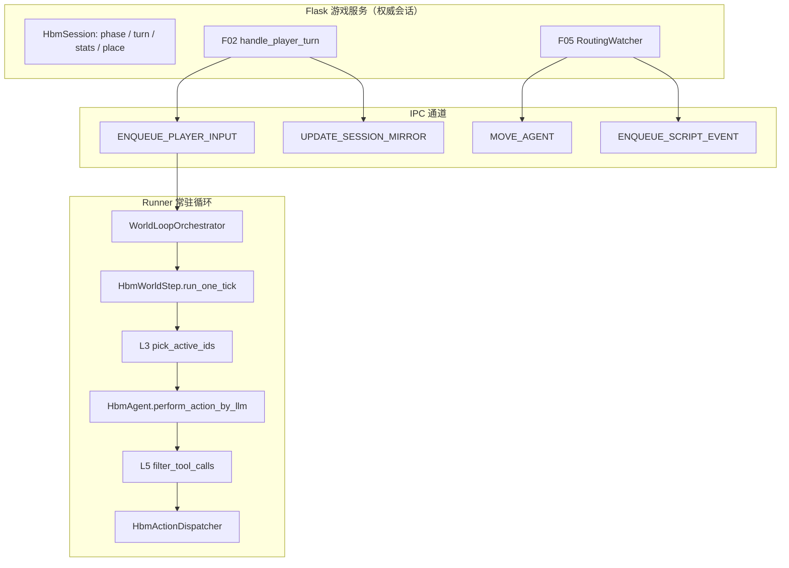
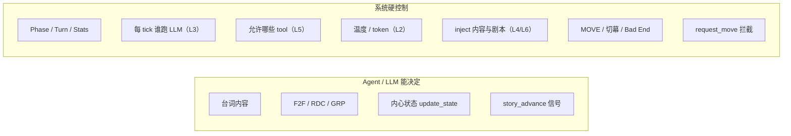

# 开发日志 33：HBM Demo Agent 控制机制完整报告

**记录时间**：2026-05-26（PR4 同步）  
**分支**：`feature/story-scenario-edit`  
**状态**：**代码现状定稿**（基于 `agent_world/hbm_demo` 当前实现：F07 控制层 + F08 虚拟玩家 + v2 常驻 World Loop + Phase 4 `agent_driven` 路由 + Phase 5 `story_advance` + F16 WebSocket）  
**文档性质**：运行时可观测行为的 **完整解释报告**（非方案草案）

**前置文档**：

- [`dev_logs/34_HBM_Demo_剧情Agent引导与虚拟玩家整合方案.md`](34_HBM_Demo_剧情Agent引导与虚拟玩家整合方案.md) — SAN 方案（F08 虚拟玩家、PR3 路由收紧、PR4 收尾）
- [`dev_logs/24_HBM_Demo_Agent行为控制整合方案.md`](24_HBM_Demo_Agent行为控制整合方案.md) — ABCS（L2–L6）原设计
- [`dev_logs/30_HBM_Demo_F07-F_Agent原生输出与全量同步方案.md`](30_HBM_Demo_F07-F_Agent原生输出与全量同步方案.md) — agent_driven 路由、F12 UI
- [`dev_logs/27_agent_world引擎与HBM_Demo_Agent行为与玩家干预机制全景.md`](27_agent_world引擎与HBM_Demo_Agent行为与玩家干预机制全景.md) — 早期全景（部分已过时，以本文为准）

**关联代码**：`agent_world/hbm_demo/core/runner/`、`features/f07_agent_control/`、`features/f02_player_turn/`、`features/f05_story_routing/`、`features/f16_world_stream/`

---

## 一、总体模型：三层分工

Demo 的 agent 控制不是单一开关，而是 **Flask 游戏层 → Runner 仿真层 → LLM 工具层** 三层协同：



| 层级 | 控制什么 | 不控制什么 |
|------|----------|------------|
| **Flask** | 玩家回合打分、inject 目标、阶段路由、Bad End / 结局 | 不直接调 LLM |
| **Runner** | 每 tick 谁跑 LLM、温度/token、工具白名单过滤、脚本事件 | 不改 Flask session 权威 |
| **LLM** | 台词、F2F/RDC/GRP、内心状态、剧情信号 | 不能自行换房间、不能越权工具 |

**核心设计原则**：agent 的「说什么、用什么合法工具」由 LLM 决定；「在哪个 Phase、谁能思考、能否移动、何时切幕」由系统决定。

---

## 二、F07 ABCS：Agent Behavior Control Stack

F07 是 demo 的 agent 控制核心，在 `turn_control.yaml` 中 `enabled: true` 时生效。它把控制拆成 L2–L6 五层：

| 层 | 名称 | 模块 | 作用 |
|----|------|------|------|
| **L2** | LLM 参数 | `llm_params.py` | 按 Phase/Turn 设 `temperature`、`max_tokens` |
| **L3** | Active 筛选 | `pick_active.py` | 每 tick 哪些 agent 调用 LLM |
| **L4** | 剧本知识 | `knowledge.py` + `story_knowledge/**` | inject 文本、thread recap、Phase 共享设定 |
| **L5** | 工具白名单 | `tool_guard.py` + `tool_matrix.yaml` | Phase×Agent 允许哪些 tool |
| **L6** | 玩家回应指令 | `player_response.py` | inject 内「你必须如何回应玩家」的硬性模板 |

另外还有 **E 系列 experience hardening**（首 F2F 强制、RDC 配额）。**scripted fallback（`f2f_fallback.py` / `reception_rdc_companion.py`）已在 dev_log/34 PR0 删除**，不再代写 Agent 台词；当前 `experience_hardening.enabled: false`，其余 E 守卫代码在但默认不生效。

---

## 三、每 Tick 发生了什么

### 3.1 常驻 World Loop（v2 模式）

`turn_control.yaml` 中 `world_loop.enabled: true`，Runner 每秒（`tick_interval_sec: 1.0`）执行一次循环：

```
drain 玩家/script 队列
  → 若有玩家 inject：清 player_memory、通知非 inject 的 primary agent
  → 加载 dialogue_injection 等脚本事件
  → set_tick_context(mirror, reset_l3_window=有新 inject)
  → HbmWorldStep.run_one_tick()
  → 写 env_status.json（current_tick、loop_state）
```

**关键入口**：`core/runner/world_loop.py` → `WorldLoopOrchestrator._run_one_cycle()`

### 3.2 单个 Tick 内部（11 步 pipeline）

`HbmWorldStep` 覆写了标准 `WorldStep`（`core/runner/world_step.py` + `agent_world/world/step.py`），关键步骤：

**Phase A（串行）**

1. 脚本 trigger → `DialogueInjectionEffect` 把 inject 文本写入 `HbmAgent.player_memory`
2. **`_pick_active(t)`** → 调用 F07 L3 `pick_active_ids`
3. GRP 投递 sweep

**Phase B（并行，同地点 agent 并行 LLM）**

4. 每个 active agent：
   - 挂载 `_batch_turn_context`、温度/token
   - `HbmAgent.perform_action_by_llm` → PerceptionBuilder 拼 prompt → OpenAI tool call
   - **`filter_tool_calls`（L5）** 过滤非法工具
   - `HbmActionDispatcher.dispatch` 执行合法工具

**Phase C（串行）**

5. `clock.advance(1)` — tick 永远 +1

### 3.3 L3 inject 独占窗口

Phase 1 默认 **inject 后前 2 tick 只有 inject 目标 agent 跑 LLM**（`inject_exclusive_ticks: 2`）。实现见 `pick_active.py`：

```python
# inject_exclusive — first N ticks after player inject: inject targets only.
exclusive = inject_exclusive_ticks_for(phase)
inject_ids = turn_context.get("inject_agent_ids") or []
if exclusive > batch_tick_index and inject_ids:
    inject_set = {int(x) for x in inject_ids}
    primary = _primary_ids(phase, player_turn)
    active = [aid for aid in primary if aid in inject_set and aid not in frozen]
    return active
```

这保证前台先回应玩家，后台 Jensen/VP 不会抢跑。

---

## 四、玩家回合如何「控制」Agent

玩家输入 **不直接改 agent 状态机**，而是通过 **inject + turn_context** 间接影响。

### 4.1 数据流

```
POST /player-turn
  → score_player_turn（F04 改 stats，不进 Agent Prompt）
  → F08 build_player_f2f_payload → Runner insert F2F（sender=0）
  → routing.build_inject_payload（F05）
  → IPC ENQUEUE_PLAYER_INPUT { events, turn_context, player_f2f?, broadcast? }
  → 下一 tick 边界 drain
  → DialogueInjection → agent.player_memory
  → turn_context 驱动 L2/L3/L5/L6
```

**F08 虚拟玩家（agent 0）**：在 `place_store` 注册、**从不**进入 L3 `pick_active`、无 LLM client。玩家话写入 `direct_message`（F2F, sender=0）；同室 NPC 从 recap/F2F 线程读取。

v2 模式下 `handle_player_turn` **立即返回 `accepted: true`**，不等 LLM 跑完；前端通过 F14 world-delta / F16 WebSocket 拉取活动。

**关键入口**：`features/f02_player_turn/handler.py` → `_handle_v2_player_turn`

### 4.2 Inject 目标（按 Phase）

| Phase | Inject 目标 | 含义 |
|-------|-------------|------|
| Phase 1 | Agent 1（前台） | 玩家在前台对话 |
| Phase 2 | Agent 2（Jensen） | 玩家在私密会议室 |
| Phase 3 | Agent 2–6 | 谈判室全员 |
| Phase 4 | 仅 Agent 2 | 结局对话只注入 Jensen |

实现：`features/f05_story_routing/routing.py` → `inject_agent_ids_for_phase()`

### 4.3 Inject 文本内容（L4 + L6）

F07 开启时，inject 由 `build_agent_knowledge(..., channel="inject")` 组装，包含 L6 约束 + Phase 共享 yaml + Agent overlay + Turn hints。

**玩家输入双通道（PR4 后）**：

| Phase | 玩家 F2F（F08） | inject / L6 |
|-------|-----------------|-------------|
| **1** | ✅ sender=0 @ reception | 完整 L6 + `玩家说：「…」`（与 F2F 短期双通道） |
| **2–4** | ✅ sender=0 同室 | **F2F 通道** inject：不含玩家 verbatim，指引从【近期对话摘要】读原话 |

实现：`player_response.inject_channel_uses_player_f2f()` + `format_f2f_aware_inject_directive()`（Phase 2+）。

### 4.3.1 NPC→玩家 F2F 投递（Bus vs emit）

| 条件 | 路径 |
|------|------|
| agent 0 **未**与 NPC 同室（Phase 1 早期） | NPC `speak_to_local` → `emit_player_facing_f2f`（recipient=0） |
| agent 0 **已**注册且同室（F08 后 Phase 1/2/4） | `FaceToFaceBus` 直投 → `bus_delivered_player_facing_f2f` 为 true，**禁止** emit 重复写库 |

模块：`features/f07_agent_control/player_facing_f2f.py`；Hook：`core/runner/world_step.py` → `_handle_speak_to_local_f2f`。

### 4.4 turn_context 字段

`features/f07_agent_control/turn_context.py` → `build_turn_context()` 生成：

```python
{
    "enabled": True,
    "phase": phase,
    "player_turn": player_turn,
    "place_id": place_id,
    "inject_agent_ids": [...],
    "player_text": "...",
    "stats": {...},
    "llm_params": { "temperature", "max_tokens" },  # L2
    "player_inject_tick": <tick>,  # Runner 注入，用于 L3 inject_exclusive
}
```

Flask accept turn 后通过 **`push_session_mirror`** 同步 Runner 的 `SessionMirrorState`（`session_mirror.py`）；inject 当 tick 会覆盖 mirror 并重置 L3 窗口计数。

### 4.5 非 inject 的 primary agent

inject 时，`notify_non_inject_active_agents`（`inject_batch.py`）给 **primary 但不在 inject 列表** 的 agent 发 `scripted_notification`，下一 tick perception 出现「# 剧本通知」，**不含玩家原话 verbatim**。

### 4.6 Inject 前清 memory（A6）

每次 inject batch 前，`clear_player_memory_for_agents` 清空 inject 目标 agent 的 `player_memory`，避免旧轮玩家台词残留。

---

## 五、L3：每 Tick 谁可以「思考」

`turn_control.yaml` 的 `phases.*` 定义 primary / frozen / passive 规则：

| Phase | primary_active | frozen / silent | passive 补充 |
|-------|----------------|-----------------|--------------|
| **1** | 1, 2, 3 | frozen: 7 | low_freq: 4,5,6（有未读消息时概率触发） |
| **2** | 2 | frozen: 1, 7 | rdc_reply: 3（Jensen 有未读 RDC 时） |
| **3** | 2, 3, 4, 5, 6 | frozen: 1 | Turn≥16 加 Sam(7) |
| **4** | 2 | present_silent: 3；frozen: 1,4,5,6,7 | — |

**frozen / present_silent 的 agent 永远不会被 pick_active 选中**，即使用户看到他们在场，也不会调 LLM。

Passive agent 补充受 `passive_max_per_batch: 1` 和概率（low/medium/high）限制，避免每 tick 全员跑 LLM。

**模块**：`features/f07_agent_control/pick_active.py`

---

## 六、L5：工具白名单与过滤

### 6.1 配置来源

`features/f07_agent_control/tool_matrix.yaml` 按 **Phase × Agent** 定义允许的工具。

**Phase 1 示例**：

| Agent | 允许工具 |
|-------|----------|
| 1（前台） | speak_to_local, send_message, story_advance, do_nothing, update_state |
| 2（Jensen） | send_message, story_advance, do_nothing, update_state |
| 3（VP） | send_message, do_nothing, update_state |
| 4–6（CEO） | speak_to_local, do_nothing |
| 7（Sam） | do_nothing |
| 全局 | move_allowed: false |

### 6.2 过滤时机

LLM **仍收到完整 `HBM_TOOLS` schema**（含 `story_advance`、`relation_change` 等），但 **post-LLM** 才过滤：

```
HbmAgent.perform_action_by_llm
  → OpenAI chat.completions.create(tools=HBM_TOOLS)
  → filter_tool_calls(agent_id, turn_context, tool_calls)
  → dispatcher.dispatch
```

当前 `tool_guard.hard_block: false`：**非法 tool 被丢弃，合法 tool 继续执行**；不是整批替换为 `do_nothing`。

**模块**：`features/f07_agent_control/tool_guard.py`

### 6.3 可用工具一览

| 工具 | 作用 |
|------|------|
| `speak_to_local` | 同地点 F2F 说话 |
| `send_message` | RDC 私信 |
| `send_to_group` | 群聊（Phase 3 开放） |
| `update_state` | 改内心状态 |
| `relation_change` | 建立/断绝关系（Phase 3） |
| `story_advance` | 标记结构化剧情信号（不替 agent 说台词） |
| `do_nothing` | 本 tick 无行动 |
| `request_move` | **被系统拦截，agent 不可用** |

### 6.4 MOVE 硬拦截

即使 yaml 允许 `move_allowed: true`（仅 Phase 3），`HbmActionDispatcher` 也会 **静默拒绝 agent 发起的 `request_move`**：

```python
# core/runner/hbm_dispatcher.py
if action_type == "request_move":
    return {"success": False, "reason": "hbm_move_ipc_only", "noop": True, ...}
```

**所有位置变更只能由 Flask 路由层经 IPC `MOVE_AGENT` 执行**。

---

## 七、LLM Prompt 如何塑造行为

`HbmAgent.perform_action_by_llm`（`core/runner/hbm_agent.py`）的 prompt 由多层拼接：

1. **System prompt**（PerceptionBuilder 5 段）：人格内核、长期目标、当前状态、小目标、场景 behavior_hint
2. **User prompt 附加段**：
   - `# 玩家/系统注入的对话记忆` ← `player_memory`（inject 写入）
   - `# 剧本通知` ← scripted_notification
   - `build_thread_recap` ← 近 20 tick 对话摘要（L4，`recap_window_ticks: 20`）
   - DemoAgent 观测正文（位置、同场、到达消息、F2F 历史）
   - **`_hbm_short_action_rules()`** ← 替换 demo 默认尾段，按 Phase/Agent/Turn 给行动约束

LLM 参数来自 L2，例如 Phase 1 `temperature: 0.45, max_tokens: 180`，Phase 3 Turn 16+ 更高（0.68 / 400 tokens）。

F15 Prompt Trace（`prompt_trace.enabled: true`）会把每次 LLM 调用的 system/user prompt 落库，便于调试「agent 为什么这样行动」。

**Perception 模块**：`agent_world/world/perception.py` → `PerceptionBuilder.build()`

---

## 八、剧情路由 vs Agent 自主

当前 `routing.yaml` 模式为 **`agent_driven`**：

```yaml
routing:
  mode: agent_driven
  stats_display_only: true
  story_advance:
    enabled: true
```

### 8.1 Agent 自主的部分

- 自由选择 **白名单内** 的工具和台词
- F2F / RDC / GRP 内容由 LLM 生成
- `update_state`、`do_nothing` 完全 agent 驱动
- Prompt + 剧本 yaml 引导风格，**不硬编码具体台词**

### 8.2 系统控制的部分

| 事件 | 触发方式 | 系统动作 |
|------|----------|----------|
| **Node A** Phase 1→2 | RDC 链 1→2→3 + Jensen→前台 approve 关键词，或 `story_advance(approve_visitor)` | Jensen → 私密会议室 |
| **Node B** Phase 2→3 | Jensen F2F / VP 正面 RDC / `return_to_negotiation` | Jensen → 谈判室 + place_mutation |
| **Node C** Phase 3→4 | Jensen 驱逐 CEO 关键词 / `expel_ceos` | CEO 4/5/6 → 前台 |
| **Bad End** | 前台 reject / `reject_visitor` / Phase1 超 10 轮未过 A | pause loop + game_over |
| **Turn 25 结局** | LLM 分类 intent + trust 阈值 | ending_id |

v2 常驻 loop 下，路由 **不在 inject 后立即跑**，而是由 **F14 poll 驱动的 `RoutingWatcher.scan_routing_if_needed`**（`features/f05_story_routing/watcher.py`）在 tick 前进时扫描 `world.db` 再触发 IPC。

Stats（vision/execution/trust/burnout）在 `agent_driven` 模式下 **仅展示**，不再作为 Node A/B/C 硬门槛（`legacy_stats` 模式才用 Turn 4/12/20 阈值）。

**路由实现**：`features/f05_story_routing/routing.py` → `apply_routing()`；信号检测：`agent_signals.py`

---

## 九、story_advance：结构化剧情信号

Phase 5 新增，让 agent 在「说完话之后」可以主动标记剧情节点，降低「说了 approve 但没触发路由」的风险。

### 9.1 LLM 工具定义

信号 enum：`approve_visitor`、`reject_visitor`、`return_to_negotiation`、`expel_ceos`、`offer_join`、`offer_seed`

定义：`core/runner/hbm_agent.py` → `STORY_ADVANCE_TOOL`

### 9.2 执行路径

```
LLM 调用 story_advance(signal=...)
  → HbmActionDispatcher.dispatch
  → world.db story_advance_log 落库（insert_story_advance_sync）
  → RoutingWatcher 扫描
  → story_signals.has_story_signal() 与 NL 关键词 OR 合并（agent_signals.py）
  → apply_routing → MOVE_AGENT / game_over
```

### 9.3 已知限制

- `offer_join` / `offer_seed` **目前只落库，未接 Node D 结局路由**
- `idle_pause_after_sec` **未实现**（world loop 不因空闲自动 pause）

**Schema**：`persistence/schema/world/story_advance_log.sql`

---

## 十、7 个 Agent 角色与控制差异

| ID | 角色 | Phase 1 控制要点 |
|----|------|------------------|
| 1 | 前台 | primary + inject 目标；可 F2F/RDC/story_advance；永不 move |
| 2 | Jensen | primary；仅 RDC/story_advance；Phase 2 起 inject 目标 |
| 3 | Tech VP | primary；仅 RDC |
| 4–6 | 三位 CEO | passive low_freq；仅 F2F/do_nothing |
| 7 | Sam | frozen（Phase 1）；Turn 16+ Phase 3 才 active |

Phase 4 只有 Jensen primary + inject；VP(3) 为 present_silent（在场但不跑 LLM）。

---

## 十一、控制权边界总结



**一句话**：Demo 让 agent 在「剧本框架 + 工具白名单 + 每 tick 激活名单」内自由发挥；**阶段推进、房间切换、结局判定** 始终掌握在 Flask 路由层，agent 无法自行「换幕」或「移动」。

---

## 十二、关键配置文件速查

| 文件 | 控制什么 |
|------|----------|
| `features/f07_agent_control/turn_control.yaml` | F07 总开关、L3 phase 配置、world loop、LLM 参数、inject_exclusive、F16 world_stream |
| `features/f07_agent_control/tool_matrix.yaml` | L5 工具白名单 |
| `features/f07_agent_control/story_knowledge/**` | L4 剧本 Bible |
| `features/f05_story_routing/routing.yaml` | agent_driven / 关键词 / story_advance |
| `hbm_scenario.yaml` | Agent soul、地点、LLM 模型、并行决策开关 |

---

## 十三、核心代码入口

| 路径 | 职责 |
|------|------|
| `features/f02_player_turn/handler.py` | 玩家 turn API，`accepted` 入队 |
| `features/f02_player_turn/inject.py` | inject 委托 F05 |
| `features/f05_story_routing/routing.py` | inject payload + apply_routing |
| `features/f05_story_routing/agent_signals.py` | agent_driven 节点检测 |
| `features/f05_story_routing/watcher.py` | 常驻 loop 路由扫描 |
| `features/f05_story_routing/story_signals.py` | story_advance 信号读 DB |
| `features/f07_agent_control/turn_context.py` | turn_context 组装 |
| `features/f07_agent_control/pick_active.py` | L3 active 筛选 |
| `features/f07_agent_control/tool_guard.py` | L5 工具过滤 |
| `features/f07_agent_control/knowledge.py` | L4 剧本 + recap |
| `features/f07_agent_control/session_mirror.py` | Flask→Runner 会话镜像 |
| `core/runner/world_loop.py` | 常驻 tick + 队列 drain |
| `core/runner/world_step.py` | HbmWorldStep tick 覆写 |
| `core/runner/hbm_agent.py` | LLM 决策 + story_advance |
| `core/runner/hbm_dispatcher.py` | dispatch + move 拦截 |
| `core/runner/ipc_handlers.py` | IPC 注册 |
| `core/runner/kernel.py` | 组装 world/agents/perception |
| `agent_world/world/step.py` | 通用 tick pipeline |
| `agent_world/demo/demo_agent.py` | 基类 agent + perception 文本化 |
| `features/f07_agent_control/player_facing_f2f.py` | E0 Bus/emit 分工 |
| `features/f08_virtual_player/player_f2f.py` | 玩家 F2F sender=0 |
| `features/f08_virtual_player/player_entity.py` | agent 0 MOVE / routing sync |
| `agent_world/script/effects/dialogue_injection.py` | inject 写 player_memory |
| `features/f16_world_stream/handler.py` | WebSocket world-delta 推送 |

---

## 十四、当前运行态要点（2026-05-26 代码快照）

| 配置项 | 当前值 |
|--------|--------|
| F07 ABCS | 全开（L2–L6） |
| F08 虚拟玩家 | **enabled**（agent 0，无 LLM tick） |
| World Loop | v2 常驻，1 tick/s，`pause_drains_queue: false` |
| 路由模式 | `agent_driven`（PR3 收紧 detect_node_b / escort F2F） |
| experience_hardening | **关闭** |
| scripted F2F/RDC fallback | **已删除**（PR0） |
| tool_guard.hard_block | **false**（丢弃非法 tool，不整批 do_nothing） |
| story_advance | **enabled** |
| world_stream (F16) | **enabled**（需 `flask-sock` 依赖） |
| UI 同步 | F16 WebSocket 优先 + F14 HTTP poll fallback |

---

## 十五、与 dev_logs/31 方案的对照

| dev_logs/31 设计意图 | 当前实现状态 |
|----------------------|--------------|
| 常驻 world loop，玩家 insert 下一 tick 边界 | ✅ `world_loop.enabled: true` |
| L3 硬控制「谁活跃」 | ✅ `pick_active.py`（hard exclude agent 0） |
| L5 软过滤（非 hard_block） | ✅ `hard_block: false` |
| 取消 E1/E2/E3 硬守卫 | ✅ `experience_hardening: false` |
| 删除 scripted fallback 代写台词 | ✅ PR0（dev_log/34） |
| F08 虚拟玩家 F2F sender=0 | ✅ PR2 |
| Phase 2+ inject 弱化双通道 | ✅ PR4 F2F 通道 inject |
| agent_driven 路由 + RoutingWatcher | ✅ PR3 收紧 |
| story_advance 结构化信号 | ✅ Phase 5 |
| Turn 25 offer_* / 弱化 Trust | ✅ PR3 `resolve_turn25_ending` |
| F16 WebSocket delta | ✅ Phase 5 |
| idle_pause_after_sec | ❌ 未实现 |

---

## 十六、运维提示

1. **依赖**：Phase 5 起 Flask 需 `flask-sock>=0.7.0`（已在 `pyproject.toml`）；未安装会导致 Flask 无法启动。
2. **验收**：`python agent_world/hbm_demo/scripts/test_m0_acceptance.py`
3. **调试 LLM 决策**：查 `agent_llm_trace` 表（F15 Prompt Inspector）

---

*本文档为 Agent 控制机制的 **现状解释报告**，后续架构变更请同步更新本节与 dev_logs/31 实施清单。*
