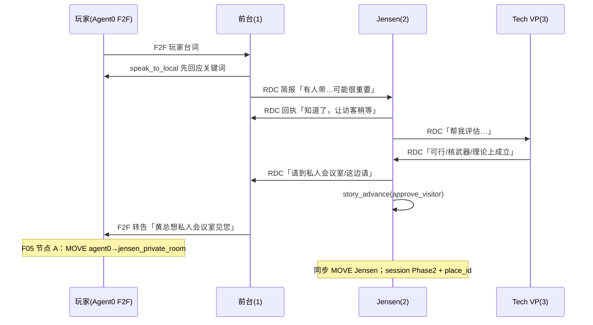

# 开发日志 34：HBM Demo — 剧情 Agent 引导、Prompt 优化与虚拟玩家整合方案

**记录时间**：2026-05-23  
**分支**：`feature/story-scenario-edit`  
**状态**：**方案定稿** · 分阶段实施  
**Feature ID**：**F08 — Virtual Player Entity**（新增）+ **F07 剧情/Prompt 补强**（延续 ABCS）+ **F05 agent_driven 剧情链**（已有，待 Prompt 对齐）

**前置文档**：

- 剧情原型 → [`dev_docs/1_story_prototype.md`](../dev_docs/1_story_prototype.md)
- ABCS / L2–L6 → [`24_HBM_Demo_Agent行为控制整合方案.md`](24_HBM_Demo_Agent行为控制整合方案.md)
- v2 常驻 Runner → [`31_HBM_Demo_Runner控制层详解与引导式Agent方案.md`](31_HBM_Demo_Runner控制层详解与引导式Agent方案.md)
- Agent 原生 / agent_driven → [`30_HBM_Demo_F07-F_Agent原生输出与全量同步方案.md`](30_HBM_Demo_F07-F_Agent原生输出与全量同步方案.md)
- 25 轮参考台词 → [`19_HBM_Demo_25轮参考台词.md`](19_HBM_Demo_25轮参考台词.md)
- 控制机制报告 → [`33_HBM_Demo_Agent控制机制完整报告.md`](33_HBM_Demo_Agent控制机制完整报告.md)

**本分支已落地（commit `a304ebc`）**：

- 删除 `f2f_fallback.py`、`reception_rdc_companion.py` 及 Runner 调用链  
- 删除 `turn_control.yaml` 中 `reception_f2f_fallback` / `reception_rdc_companion`  
- L6 改为 Prompt 软引导（禁止提及「系统代发短句」）

---

## 一、方案目标（不可协商）

| # | 目标 | 验收标准 |
|---|------|----------|
| G1 | **所有玩家可见台词来自 Agent LLM** | 中屏 F2F 无模板句；无系统代写 RDC/F2F |
| G2 | **Phase 切换由 Agent 行为链驱动** | 节点 A/B/C 由 RDC 链 + `story_advance` 触发，非 Turn+Stats 硬门槛 |
| G3 | **玩家输入 strongly 影响 Agent** | 每轮 inject 目标先回应玩家关键词；Phase 2–4 同室 NPC 从 F2F 线程读到玩家话 |
| G4 | **对话像真人、长短得当** | L2 分 Phase 温度/token；L4 详述世界态；输出口语 1–5 句 |
| G5 | **Stats 不参与 Agent/路由 gate** | 左栏展示 only；Turn 25 结局可弱化 Trust 或改 Agent 信号 |
| G6 | **轻量虚拟玩家 Agent** | `agent_id=0` 占位、可 F2F、**永不 tick LLM** |
| G7 | **玩家随 Phase 在引擎内移动** | `place_store.L[0]` 与 `session.place_id` 一致；仅 F05 路由触发 MOVE |

---

## 二、总体架构：四层分工

```text
┌─────────────────────────────────────────────────────────────────┐
│ L6 + L4 Prompt 软引导（教 Agent 怎么演）                          │
│   soul 精简 + story_knowledge + turn_hints + 玩家中心 inject      │
├─────────────────────────────────────────────────────────────────┤
│ F08 虚拟玩家 Agent 0（对话机制 + Phase 位置）                     │
│   玩家在 place_store 有实体；玩家输入 → F2F sender=0            │
│   不跑 LLM；**Phase 切换时由 F05 同步 MOVE**（§5.6）            │
├─────────────────────────────────────────────────────────────────┤
│ F05 agent_driven 路由（切幕执行层）                               │
│   读 world.db：RDC 链 / story_advance / 关键词 → IPC MOVE       │
├─────────────────────────────────────────────────────────────────┤
│ L3 pick_active + L2 llm_params（舞台调度，非替 Agent 说话）       │
│   frozen / primary / passive；Phase 内谁 tick                   │
└─────────────────────────────────────────────────────────────────┘
```

**原则**：Prompt **引导**；虚拟玩家 **补机制**；路由 **执行**；L3 **保底**。禁止再用模板/fallback 替 Agent 说话。

---

## 三、Phase 剧情链（Agent 自主推进）

与 [`dev_docs/1_story_prototype.md`](../dev_docs/1_story_prototype.md) 对齐；**Turn 为规划区间**，实际 Phase 以 session + DB 信号为准。

### 3.1 Phase 1 → 2：前台破局（节点 A）

**决策者**：Jensen（Agent 2）；前台（Agent 1）筛客；Tech VP（Agent 3）评估。



**F05 检测**（已实现 `agent_driven`，**PR1 需对齐 Prompt + 可选收紧 escort 条件**）：

- RDC 链 1→2、2→3、2→1（批准词）**或** `story_advance(approve_visitor)`
- **Bad End**：前台 F2F 拒绝 / `reject_visitor` / Phase 1 超时（10 Turn），**非** Turn4 Stats
- **叙事时序**：`apply_routing` 在 **本 Turn tick 批次结束后**执行（`handler.py`）；Prompt 要求 Jensen **先** RDC 批准 → 前台 F2F「请跟我来」→ **再** `story_advance(approve_visitor)`，避免先切 Phase 后出 escort 台词
- **可选加固（PR3）**：`detect_node_a` 增加「前台 F2F 含 `escort_keywords`」与 RDC 链 AND（`routing.yaml` 已有 `escort_keywords`，当前 **未接入** `detect_node_a`）

### 3.2 Phase 2 → 3：私密审查（节点 B）

- Jensen 每轮 **先 F2F 回应玩家**（同室，F08 后玩家话在 F2F 线程）
- RDC→Tech VP 求证；VP 正面 RDC 含「可行」「核武器」「理论上成立」
- Jensen 认可 → **先** F2F 告知玩家「回谈判室」→ **再** `story_advance(return_to_negotiation)`
- F05 节点 B：Jensen + **玩家 Agent 0** MOVE → `negotiation_room`；`session.place_id` 同步
- **PlaceMutation**：节点 B 同时 enqueue `place_mutation`，改写 `negotiation_room.behavior_hint`（「死一般的寂静…」）；F12 推送 `world_events` kind=`place_mutation`
- **`phase2_start_tick`**：节点 A 写入；节点 B 的 `detect_node_b` 检测窗口为 **`since_t = phase2_start_tick` → 当前 tick**（非 session 开局）

**F05 检测 — 方案定稿 vs 代码现状（PR1/PR3 必改）**：

| 路径 | 方案要求 | 代码现状（`agent_signals.detect_node_b`） | 处置 |
|------|----------|-------------------------------------------|------|
| `story_advance(return_to_negotiation)` | ✅ 触发 | ✅ 已实现 | 保持；**Prompt 主路径** |
| Tech VP→Jensen 正面 RDC | ✅ 触发 | ✅ `has_positive_tech_vp_rdc` | 保持 |
| Jensen 私密室任意 F2F | ❌ **不足以**单独触发 | ⚠️ **任意** Jensen F2F @ `jensen_private_room` 即触发 | **PR3 删除或收紧**：须含「回谈判室/认可/可以」等关键词 **且**（VP 正面 RDC **或** 已有 `story_advance`） |

> 否则 Phase 2 **第一轮** Jensen 开口即可误进 Phase 3，与上表叙事链矛盾。

### 3.3 Phase 3 → 4：舌战清场（节点 C）

- NVIDIA 帮玩家；CEO 攻击玩家
- Turn 16 系统广播 + Sam inject（保留，系统事件）
- Jensen 决定请 CEO 离场 → F2F/RDC 驱逐词 + `story_advance(expel_ceos)`
- F05 节点 C：CEO 4/5/6 MOVE → `nvidia_reception`；**玩家不移动**（仍在谈判室）

### 3.4 Phase 4 → 结局（节点 D）

- inject 仅 `[2]`；Tech VP **present_silent** 旁听
- Jensen 1v1 F2F；Turn 25 意图 + Trust（或改为 `offer_join` / `offer_seed` 信号）

### 3.5 全角色 Phase 位置（路由 MOVE 范围）

> 完整表见 §5.8。节点 A/B **仅 MOVE 玩家(0) + Jensen(2)**；Tech VP 全程 **不** 随玩家换房（Phase 2 在 `negotiation_room` 远程 RDC）；前台 Phase 2 起 **frozen @ reception**。

---

## 四、Prompt / 知识库优化（L4 + L6 + soul）

### 4.1 设计原则

| 层级 | 输入（给 LLM 读） | 输出（Agent 说出口） |
|------|-------------------|----------------------|
| L1 soul | 性格、长期目标 | 1 句原则 |
| L4 shared | Phase 世界态、禁止行为、剧情要点 | — |
| L4 agent overlay | 角色目标、example_lines、checklist | — |
| L6 inject | 必须先回应玩家 + Phase/agent 细则 | 1–5 句口语 |
| L2 | — | max_tokens / temperature 上限 |

**混合知识库**（定稿）：`story_knowledge/shared/phase_N.yaml` + `agents/agent_ID.yaml` + `turn_hints.yaml`。

**Stats**：**不写入** Agent Prompt；左栏 UI 展示 only。知识库删除「Turn 4 V+E≥15」等 Stats 硬门槛文案，改为 Agent 驱动描述。

### 4.2 各 Agent Phase 1 Prompt 要点（实施清单）

#### Agent 1 前台

- 先 `speak_to_local` 回应玩家关键词，再判断是否 RDC→2
- 有价值：RDC 简报（不展开技术）；闲聊：仅 F2F，不 RDC
- 收到 Jensen 批准 RDC → F2F 转告玩家去私人会议室
- L6 已增：**禁止沉默或只 RDC 不 F2F**（无系统 fallback）

#### Agent 2 Jensen（Phase 1 在谈判室）

- 收到前台 RDC 后顺序：① RDC→1 回执 ② RDC→3 请 VP 评估 ③ 决定见访客 → RDC→1 批准 + `story_advance(approve_visitor)`
- 禁止对玩家 `speak_to_local`（玩家不在谈判室）
- 同室与 CEO/VP 短句互怼 HBM 涨价（背景压力）

#### Agent 3 Tech VP（Phase 1 被动）

- Jensen RDC 求证时：1–3 句评估；正面含「可行」「核武器」「理论上成立」
- 无 Jensen 未读 RDC 时：偶尔 F2F 插话或 RDC→2

#### L6 增补（`player_response.py` — 待实施）

为 Jensen 增加 `story_advance` 调用说明：

- Phase 1：`approve_visitor`（先 RDC 批准语，再 signal）
- Phase 2：`return_to_negotiation`（先 F2F 告知玩家，再 signal）
- Phase 3：`expel_ceos`

### 4.3 知识库文件待改清单

| 文件 | 改动 |
|------|------|
| `shared/phase_1.yaml` | `plot_beats` 去掉 Turn4 Stats；改为 RDC 链 + story_advance |
| `shared/phase_2.yaml` | 去掉 Turn12 Execution 硬门槛；改为 VP 正面 RDC + Jensen 认可 |
| `shared/phase_3.yaml` | 去掉 Turn20 Burnout/Vision 硬门槛；改为 Jensen 清场信号 |
| `agents/agent_1.yaml` | Phase 1 role_goal / example_lines（见 §4.2） |
| `agents/agent_2.yaml` | Phase 1–4 role_goal + story_advance 时机 |
| `agents/agent_3.yaml` | Phase 1/2 被动 RDC 规格 |
| `hbm_scenario.yaml` soul | 各 Agent 增补 Phase 行为剧本（与 overlay 一致，不重复 Stats 规则） |

---

## 五、F08 虚拟玩家 Agent（轻量、不跑 LLM）

### 5.1 定义

```yaml
# hbm_scenario.yaml 新增
agents:
  - agent_id: 0
    name: "玩家"
    location: nvidia_reception   # 随 session.place_id IPC 同步
    soul: ""                     # 空；永不 perform_action_by_llm
```

| 属性 | 规格 |
|------|------|
| **agent_id** | `0`（与现有 `PLAYER_RECIPIENT_ID=0` 一致） |
| **place_store** | 注册于当前 `session.place_id` |
| **pick_active** | **永久 frozen**，不进入任何 tick LLM |
| **玩家输入** | Flask `player-turn` → 写 **F2F**（sender=0, recipient=同室 NPC 或 0 广播行） |
| **Phase 切换** | F05 路由触发 **IPC MOVE agent 0**（见 §5.6） |
| **禁止** | DialogueInjection 替玩家跑 LLM；agent 0 调用任何 tool；**禁止 request_move** |

### 5.2 与现有机制的关系

| 现状 | F08 后 |
|------|--------|
| 玩家话 → inject → `player_memory` | **同室 Phase**：玩家话 → **F2F sender=0**；NPC 从 recap/F2F 读 |
| `emit_player_facing_f2f`（NPC→玩家） | 保留：NPC `speak_to_local` 时 recipient=0（或 co-agent 存在时走 Bus） |
| Phase 1 Jensen 看不到玩家原文 | **不变**：Jensen 仅 notification + 前台 RDC，符合剧情 |
| Phase 2 inject 仅 `[2]` | Jensen 从 **F2F 线程**读玩家；可弱化 `player_memory` 双通道 |

### 5.3 玩家输入管线（目标）

```text
POST /player-turn
  ├─ F04 score_player_turn（Stats UI only，不进 Agent Prompt）
  ├─ F08 emit_player_f2f(agent_id=0, place_id, content=player_text)
  ├─ [可选] 本 Phase inject 目标仍收 L6 前缀（Phase 1 前台）
  ├─ ENQUEUE_PLAYER_INPUT（turn_context + events 若仍需要 notification）
  └─ World loop tick → 同室 NPC 观测含玩家 F2F
```

**Phase 分策略**：

| Phase | 玩家 F2F | inject / L6 | 说明 |
|-------|----------|-------------|------|
| 1 | ✅ agent 0 @ reception | 前台 `[1]` 保留 L6 全文 | Jensen 仍靠 RDC；**短期双通道**（见下） |
| 2 | ✅ agent 0 @ jensen_private_room | `[2]` L6 可缩短（F2F 已有全文） | 1v1 最大收益 |
| 3 | ✅ agent 0 @ negotiation_room | batch `[2–6]` + F2F | CEO 可从 recap 见玩家 |
| 4 | ✅ agent 0 @ negotiation_room | `[2]` only | 终局 1v1 |

**Phase 1 双通道（PR2 前可接受）**：同一 Turn 内玩家话可能同时进入 **F2F sender=0** 与 **DialogueInjection→前台 `player_memory`**。PR1 验收 **不要求** Phase 2 F2F 线程（依赖 PR2）；PR4 再弱化 Phase 2+ 的 inject 重复。

#### 5.3.1 玩家 F2F 写入规格（`player_f2f.py`）

| 字段 | 值 |
|------|-----|
| `sender_id` | `0` |
| `recipient_id` | 本 Phase 主对话 NPC：`Phase1→1`，`Phase2→2`，`Phase3/4→2`（与 `speak_to_local` 对偶） |
| `place_id` | `place_store.L_t(0)` == `session.place_id` |
| `content` | 玩家原文（**不加**「玩家说：」前缀；inject/L6 侧自行加） |
| `channel_type` | `F2F` |
| `attempted_at` / `arrive_at` | 与 player-turn 当前 tick 对齐（可 `t` 或 `t+0.5` 保证排序在批内 NPC 前） |

**UI 展示**：`get_name_map()[0]` 必须为 **`"玩家"`**（见 §5.7）；否则 F12 `sender` 会变成 `agent_0`，剧情字幕无法识别玩家。

### 5.4 模块结构（待建）

```text
agent_world/hbm_demo/features/f08_virtual_player/
├── __init__.py
├── phase_places.yaml       # Phase → place_id 真相源
├── player_entity.py        # agent 0 注册、sync_player_place_on_routing
├── player_f2f.py           # player-turn → insert F2F from sender=0
└── config.yaml             # enabled, agent_id: 0
```

**改动锚点**：

| 文件 | 变更 |
|------|------|
| `hbm_scenario.yaml` | 增加 agent 0 |
| `kernel.py` | 创建 agent 0 占位（无 LLM client 或 stub） |
| `pick_active.py` | 永远排除 agent 0 |
| `f02_player_turn/handler.py` | player-turn 调用 F08 emit |
| `f05_story_routing/routing.py` | 节点 A/B 调用 `sync_player_place`；节点 C **不** MOVE 玩家 |
| `f05_story_routing/watcher.py` | 复用 `apply_routing`（无额外逻辑） |
| `f01_session/lifecycle.py` | start/reset 初始化 agent 0 位置 |
| `f01_session/constants.py` | name_map 含 `0: "玩家"` |
| `web/src/constants/agents.ts` | `resolveSpeakerAgentId`：`sender_id===0` → `"player"`（可选加固） |
| `dev_docs/1_story_prototype.md` | §一 改为「玩家 = Agent 0 轻量实体」；§四 与 §5.8 对齐 |

### 5.5 可废弃项（F08 稳定后）

- 逐步减少 inject 对 `player_memory` 的依赖（Phase 2+ 优先）
- `emit_player_facing_f2f` 保留 NPC→玩家方向，逻辑可简化

### 5.6 Phase 驱动的玩家移动（Agent 0 位置同步）★ 新增

> **现状缺口**：`apply_routing` 在节点 A/B 已更新 **`session.place_id`**，并 IPC MOVE **Jensen**；但引擎 **`place_store` 中没有玩家实体**，前端 `player_place_id` 来自 session 镜像，**与 Runner 内 F2F/同室判定脱节**。F08 必须补齐：**玩家 Agent 0 只随 Phase 切换移动，不由 LLM 决定**。

#### 5.6.1 权威映射：Phase → 玩家地点

与 [`dev_docs/1_story_prototype.md`](../dev_docs/1_story_prototype.md) §四 一致；**唯一真相源**建议放在 `f08_virtual_player/phase_places.yaml`（或 `routing.py` 常量），F05 与 F08 共用：

| Phase | 玩家 `place_id` | 叙事含义 | 相对上一 Phase 是否换房间 |
|-------|-----------------|----------|---------------------------|
| **Phase 1** | `nvidia_reception` | 英伟达接待前台 | 初始 |
| **Phase 2** | `jensen_private_room` | 前台/黄总带入私密会议室 | ✅ 移动 |
| **Phase 3** | `negotiation_room` | 回到主谈判室舌战 | ✅ 移动 |
| **Phase 4** | `negotiation_room` | 终局仍在谈判室（CEO 已离场） | ❌ **不移动** |

**不变量**（每轮 session 保存前断言）：

```text
session.place_id == place_store.L_t(0) == PHASE_PLAYER_PLACE[session.phase]
```

#### 5.6.2 何时 IPC MOVE agent 0（与路由节点绑定）

玩家移动 **仅** 在 F05 节点触发时发生，**与 Stats/Turn 编号无关**（agent_driven 模式下由 Agent 行为链触发节点）。

| 路由节点 | 触发条件（已有） | Jensen MOVE | **玩家 Agent 0 MOVE** | `session.place_id` |
|----------|------------------|-------------|------------------------|-------------------|
| **A** Phase 1→2 | `detect_node_a` | → `jensen_private_room` | → **`jensen_private_room`** | 更新 |
| **B** Phase 2→3 | `detect_node_b` | → `negotiation_room` | → **`negotiation_room`** | 更新 |
| **C** Phase 3→4 | `detect_node_c` | CEO 4/5/6 → `nvidia_reception` | **不 MOVE**（已在谈判室） | **不变** |
| **开局** session/start | — | 各 Agent 初始位 | → **`nvidia_reception`** | 初始 |
| **重开** session/reset | — | reset 场景 | → **`nvidia_reception`** | 初始 |

**节点 A 叙事链（与 Prompt 对齐）**：

1. Jensen RDC→前台「请到私人会议室 / 这边请」  
2. 前台 F2F→玩家「黄总想在私人会议室见您，请跟我来」  
3. `story_advance(approve_visitor)` 或 RDC 链满足 → **本 Turn tick 结束后** F05 执行 MOVE  
4. **路由批次**：`MOVE_AGENT(2)` + `MOVE_AGENT(0)` + `session.phase=Phase2` + `session.place_id=jensen_private_room` + `phase2_start_tick`

**节点 B**：Jensen 认可方案、VP 正面 RDC 后 → Jensen 与玩家 **一同回到** `negotiation_room`（Jensen MOVE + 玩家 MOVE）。

**节点 C**：玩家 **已在** `negotiation_room`，只需 CEO 离场；**切勿** 对 agent 0 再发 MOVE。

#### 5.6.3 实现规格（F08 + F05）

**新增 API**（`features/f08_virtual_player/player_entity.py`）：

```python
PLAYER_AGENT_ID = 0

PHASE_PLAYER_PLACE: dict[str, str] = {
    "Phase 1": "nvidia_reception",
    "Phase 2": "jensen_private_room",
    "Phase 3": "negotiation_room",
    "Phase 4": "negotiation_room",
}

def target_place_for_phase(phase: str) -> str: ...

def sync_player_place_on_routing(
    session,
    *,
    ipc_client,
    new_phase: str,
    node: str,  # "A" | "B" | "C"
    ipc_timeout: float,
) -> dict:
    """Update session.place_id and IPC MOVE agent 0 when place changes."""
```

**改动 `apply_routing`（`routing.py`）** — 节点 A/B 在现有 Jensen MOVE 之后 **统一调用** `sync_player_place_on_routing`（禁止散落双写）：

```python
# 节点 A 示例
send_move_agent(ipc_client, agent_id=JENSEN_ID, place_id=PLACE_JENSEN_ROOM, ...)
sync_player_place_on_routing(
    session, ipc_client=ipc_client, new_phase="Phase 2", node="A", ipc_timeout=...
)
session.phase2_start_tick = current_tick
```

**节点 C 仅**：

```python
session.phase = "Phase 4"
# session.place_id 保持 negotiation_room，不 MOVE agent 0
```

**World Loop 路径**：`RoutingWatcher.scan_routing_if_needed` 已调用同一 `apply_routing` → **无需双份逻辑**；路由后 `push_session_mirror` 把 `place_id` 同步给 Runner mirror。

**session/start 与 reset**：

- `kernel.build_kernel` / `reset_world_runtime`：注册 agent 0 @ `nvidia_reception`  
- `HbmSession.place_id` 初始化为 `nvidia_reception`

#### 5.6.4 前端与 F12 delta

| 通道 | 行为 |
|------|------|
| `session.place_id` | Flask 权威；路由后写入 |
| `delta.player_place_id` | F12 从 session/task 读出；**剧情模式背景切换的主通道** |
| `delta.location_changes` | `MOVE_AGENT(0)` → `location_log`；`agent_id: 0`（A/B 节点） |
| `delta.agent_locations["0"]` | 引擎侧可选；**前端 WorldStage 不依赖此键** |
| `worldSync` | **`agentLocations["player"]`**（非 `"0"`）由 `player_place_id` 覆盖写入 |

> 前后端 ID 映射见 **§5.7**。验收：剧情模式看 `player_place_id` + `placeId`；上帝模式看 `location_changes` + `"player"` 圆点。

**剧情模式**：`placeId` 变化 → 切换 `story/places/*_bg.webp`；`phaseToast`（`phaseTransitions.ts`）。

**routing world_event 文案（PR3 定稿）**：

| 节点 | 当前 `ROUTING_WORLD_EVENT_CONTENT` | 剧情向文案（可选替换 constants） |
|------|-----------------------------------|----------------------------------|
| A | 「Jensen 进入私人会议室，Phase 2 开始」 | 「前台带你穿过走廊，进入私密会议室。Jensen 推门而入。」 |
| B | 「Jensen 返回谈判室，Phase 3 开始」 | 「Jensen 带你回到主谈判室，气氛为之一变。」 |
| C | 「CEO 4/5/6 被请至前台，Phase 4 开始」 | 「三位 CEO 被请离谈判室，终局只剩你与 Jensen（Tech VP 旁听）。」 |

**定稿**：PR3 统一改 `f12_world_sync/constants.py` 的 `ROUTING_WORLD_EVENT_CONTENT` 为右列（或保留左列作上帝模式、右列作 `phaseToast` 专用——二选一，禁止两套长期并存）。

#### 5.6.5 禁止与边界

| 规则 | 说明 |
|------|------|
| **禁止 agent 0 跑 LLM** | 不 tick、无 tool、无 request_move |
| **禁止玩家自选地点** | 前端 `request_place_id` 已忽略（handler 日志）；F08 后仍只读 session |
| **禁止 Phase 内自主 MOVE** | 与 NPC 相同：Phase 1–2 全员禁 request_move；玩家仅 F05 改位 |
| **Bad End** | agent 0 留 reception 或 session 终止；不进入 Phase 2 地点 |
| **节点 C 勿误 MOVE 玩家** | Phase 3→4 同地点；若误 MOVE 会导致 F2F 房间 filter 错乱 |

#### 5.6.6 验收（玩家移动专项）

- [ ] 节点 A 后：`place_store.L[0] == jensen_private_room` 且 session 一致  
- [ ] 节点 B 后：`place_store.L[0] == negotiation_room`  
- [ ] 节点 C 后：`place_store.L[0]` 仍为 `negotiation_room`，`session.phase == Phase 4`  
- [ ] F12 delta 含 `location_changes` 中 `agent_id: 0`（A/B 节点）  
- [ ] 剧情模式背景随 Phase 2/3 切换；Phase 3→4 背景不变、CEO 圆点离开谈判室  
- [ ] 全程无 agent 0 的 LLM / tool 日志  

### 5.7 前后端玩家 ID 与 name_map

| 层 | 标识 | 用途 |
|----|------|------|
| 引擎 / IPC / `location_log` | `agent_id = 0` | MOVE、F2F sender、Bus |
| F12 `agent_locations` | 键 `"0"`（可选） | ReadOnlyWorldDB 快照 |
| 前端 WorldStage / 剧情 | `PLAYER_AGENT_ID = "player"` | 圆点、`agentsInPlace`、字幕 |
| F12 `player_place_id` | place 字符串 | **玩家位置权威 UI 源** |
| 显示名 | `"玩家"` | `name_map[0]`、`sender_display_name`、前端 `PLAYER_SENDER` |

**PR2 必做**：

1. `hbm_scenario.yaml` agent 0 `name: "玩家"` → `get_name_map()` 含 `0`  
2. 前端 `resolveSpeakerAgentId`：除 `isPlayerSender(sender)` 外，**`sender_id === 0` → `"player"`**  
3. `worldSync.applyWorldDelta` 继续用 `player_place_id` 写 `agentLocations["player"]`（不改为读 `"0"`）

### 5.8 全角色 Phase 位置表

| Agent | Ph1 | Ph2 | Ph3 | Ph4 | 路由节点 MOVE |
|-------|-----|-----|-----|-----|---------------|
| **0 玩家** | reception | jensen_room | negotiation | negotiation | A→jensen_room；B→negotiation；C 不动 |
| **1 前台** | reception | reception (frozen) | reception (frozen) | reception (frozen) | 不 MOVE |
| **2 Jensen** | negotiation | jensen_room | negotiation | negotiation | A→jensen_room；B→negotiation |
| **3 Tech VP** | negotiation | negotiation (RDC) | negotiation | negotiation (present_silent) | 不 MOVE |
| **4/5/6 CEO** | negotiation | negotiation | negotiation | **reception** | C→reception |
| **7 Sam** | openai_hq | openai_hq | openai_hq (Turn16+) | frozen | 不 MOVE |

**叙事说明**：节点 A「前台带你」为 **离屏 escort**；Agent 1 仍留 reception（Phase 2 `frozen`）。Tech VP Phase 2 在谈判室 **远程 RDC**，与私密室 1v1 不矛盾。

### 5.9 NPC→玩家 F2F 投递分工（Bus vs `emit_player_facing_f2f`）

| 条件 | 投递路径 |
|------|----------|
| F08 前；或 agent 0 **未**在 `place_store` | NPC `speak_to_local` → `emit_player_facing_f2f`（`recipient_id=0`） |
| F08 后；agent 0 **已**注册且与 NPC **同室** | FaceToFaceBus → `agents_at(place)` 含 0 → **Bus 直投**，`should_emit_player_facing_f2f` 为 false（`recipients` 非空） |
| F08 后；NPC 与玩家 **不同室**（Phase 1 Jensen） | 仍无 Bus；Jensen **不** F2F 玩家（仅 RDC 链） |

**PR4**：F08 稳定后简化 `emit_player_facing_f2f` 分支；**禁止** Bus 与 emit 对同一句 **重复写库**。

---

## 六、Stats 策略

| 项 | 策略 |
|----|------|
| F04 打分 | **保留**，每轮更新左栏 |
| 路由 A/B/C | **已** `agent_driven`，不看 Stats |
| Turn 4 Bad End | **已** 关闭 Stats gate；Agent 拒绝 / 超时 |
| Agent Prompt | **不注入** Stats |
| Turn 25 结局 | **Phase 2 可选改**：`story_advance(offer_join/offer_seed)` + 意图 LLM，Trust 仅作 tie-break |
| `stats_display_only` | 配置已有，建议代码层删除 legacy `_legacy_node_*` 或文档标注 deprecated |

---

## 七、已删除的硬编码路径（勿恢复）

| 已删 | 原因 |
|------|------|
| `f2f_fallback.py` 模板 F2F | 替 Agent 说话 |
| `reception_rdc_companion.py` | 替前台写 RDC |
| `world_loop` 批末 fallback | 同上 |
| L6「系统代发短句」 | 与 G1 冲突 |

**仍保留（非 Agent 台词代写）**：

- `IMMEDIATE_MSG_PLACEHOLDER`：API1 UI 占位，不进 world.db
- Turn 16 广播 / Sam inject：系统剧情事件
- Bad End stub：仅 DB 无拒绝 F2F 时的 UI 兜底（可后续改为必须 Agent 拒绝）

---

## 八、实施路线图（分 PR）

### PR0 — 已完成 ✅ `a304ebc`

- 删除 scripted fallback + RDC companion
- L6 软引导补强

### PR1 — Prompt / 知识库对齐（F07 剧情补强）

| 项 | 内容 |
|----|------|
| P1.1 | 更新 `shared/phase_*.yaml` 去掉 Stats 硬门槛 |
| P1.2 | 更新 `agents/agent_{1,2,3}.yaml` + `hbm_scenario.yaml` soul |
| P1.3 | L6 增补 Jensen `story_advance` 时机（`player_response.py`） |
| P1.4 | `turn_hints.yaml` 按 Phase 节点对齐 |
| P1.5 | Prompt 强调节点 B：**先 F2F 再** `return_to_negotiation`；节点 A：**先前台 F2F 再** `approve_visitor` |

**验收**：本地 Phase 1 跑 3–5 轮，Observer 见完整 RDC 链；无模板 F2F。**不含** Phase 2 玩家 F2F 线程（待 PR2）。

### PR2 — F08 虚拟玩家 Agent + Phase 移动

| 项 | 内容 |
|----|------|
| P2.1 | scenario + kernel agent 0 @ reception；pick_active / `_all_active_agent_ids` 永久排除 0 |
| P2.2 | `phase_places.yaml` + `sync_player_place_on_routing` |
| P2.3 | `apply_routing` 节点 A/B：MOVE agent 0 + session；节点 C：仅改 phase |
| P2.4 | `player-turn` → F2F sender=0（§5.3.1 字段规格） |
| P2.5 | §5.7 name_map + 前端 `sender_id===0`；剧情模式背景随 `player_place_id` |
| P2.6 | 同步 `dev_docs/1_story_prototype.md` §一/§四 |
| P2.7 | E2E：节点 A 后 agent 0 与 Jensen 同室；Bus 投递 NPC→玩家 F2F |

**验收**：Phase 2 中屏 F2F 来自 Agent；`location_changes` 含 agent 0（A/B）；节点 C 玩家不移动；agent 0 无 LLM 日志；字幕识别「玩家」。

### PR3 — F05 路由收紧 + F03 完成语义 + 结局

| 项 | 内容 |
|----|------|
| P3.1 | **收紧 `detect_node_b`**（§3.2 表）；扩展 `test_m0_acceptance` 断言「首句 F2F 不触发 B」 |
| P3.2 | 可选：`detect_node_a` 接入 `escort_keywords` + 前台 F2F |
| P3.3 | 统一 `ROUTING_WORLD_EVENT_CONTENT` 文案（§5.6.4） |
| P3.4 | Phase 1/4 F2F 优先 completed（§13.2/13.5 dev_log/24） |
| P3.5 | Turn 25 结局弱化 Trust 或接 `offer_*` 信号 |

### PR4 — 可选收尾

- Phase 2+ 减少 `player_memory` inject 双通道（§5.3 Phase 1 双通道）
- 简化 `emit_player_facing_f2f`（§5.9）
- 更新 dev_log/33 反映 fallback 已删除

---

## 九、验收 Checklist（整体）

### 行为

- [ ] Phase 1：前台 F2F 先回应玩家；有价值则 RDC 链；Jensen 发 `approve_visitor` 后进 Phase 2
- [ ] Phase 2：Jensen 每轮 F2F 回应玩家；**VP 正面 RDC 或 `return_to_negotiation` 后**进 Phase 3（非首句 F2F 误触）
- [ ] Phase 3：NVIDIA 帮玩家；Turn 16 广播；Jensen 清场后进 Phase 4
- [ ] Phase 4：仅 Jensen 与玩家 F2F；VP 无输出
- [ ] 全程无「您提到的{kw}，我需要跟黄总确认」类模板句

### 机制

- [ ] agent 0 在 place_store，**从不**出现在 LLM tick 日志
- [ ] 玩家 F2F `sender_id=0`；UI 显示「玩家」/ 字幕 `speakerId=player`
- [ ] Phase 切换时 agent 0 与 session `place_id` 一致（§5.6 不变量）
- [ ] 节点 A/B 后 `location_changes` 含 agent_id=0；节点 C 玩家不移动
- [ ] Stats 变化不影响路由；左栏仍更新

### 回归

- [ ] `test_m0_acceptance.py` 全过
- [ ] `npm run build` 通过
- [ ] 剧情模式 + 上帝模式 UI 正常

---

## 十、风险与回滚

| 风险 | 缓解 |
|------|------|
| 删 fallback 后 Phase 1 中屏空 | PR1 Prompt 强化 + PR2 玩家 F2F；人工试玩 Turn1–4 |
| 节点 B 首句 F2F 误触 Phase 3 | PR3 收紧 `detect_node_b`（§3.2）；Prompt 主路径 `story_advance` |
| Phase 1 inject+F2F 重复 | PR4 弱化 inject；PR1 验收不覆盖 |
| 节点 A 先切 Phase 后 escort F2F | Prompt 顺序 + PR3 可选 escort_keywords gate |
| F2F 显示 `agent_0` | §5.7 name_map + 前端 sender_id 映射 |
| agent 0 误进 tick | pick_active hard exclude + 无 soul/无 LLM client |
| 节点 C 误 MOVE 玩家 | 节点 C 分支禁止 `send_move_agent(0)`；Phase 4 place 与 Phase 3 相同 |
| session 与 place_store 漂移 | `sync_player_place_on_routing` 双写 + 断言不变量 |
| 回滚 fallback | **不建议**；若必须，恢复 git `f2f_fallback.py` 但默认 false |

---

## 十一、与 Feature 注册关系

| Feature | ID | 目录 | 状态 |
|---------|-----|------|------|
| ABCS / Prompt | F07 | `features/f07_agent_control/` | 进行中 · PR1 |
| 虚拟玩家 | **F08** | `features/f08_virtual_player/` | 待建 · PR2 |
| 路由 agent_driven | F05 | `features/f05_story_routing/` | 已实现 · **PR3 收紧 detect_node_b** |
| 全量 UI | F12/F16 | 已有 | 不变 |

在 `features/__init__.py` 注册 F08：`status: planned` → `in_progress` → `implemented`。

---

## 十二、方案命名

| 项 | 值 |
|----|-----|
| 方案代号 | **Story Agent Native（SAN）** |
| 核心公式 | **Prompt 引导 + 虚拟玩家 F2F + agent_driven 路由** |
| 文档版本 | **v1.2** · 2026-05-23（§5.7–5.9、§3.2 路由收紧、前后端 ID、全角色位置表） |
| 分支 | `feature/story-scenario-edit` |
| 下一步 | **PR1 Prompt/知识库** → **PR2 F08** → **PR3 路由收紧+结局** |

---

*本文档为 HBM Demo 剧情体验升级的**单一实施依据**；Prompt 细则以 §4 + [`24`](24_HBM_Demo_Agent行为控制整合方案.md) 为准，路由以 [`dev_docs/1`](../dev_docs/1_story_prototype.md) + F05 `agent_signals.py`（**§3.2 PR3 收紧**）为准，虚拟玩家与 Phase 移动以 §5（**§5.3.1 / §5.6–§5.9**）为准。*
