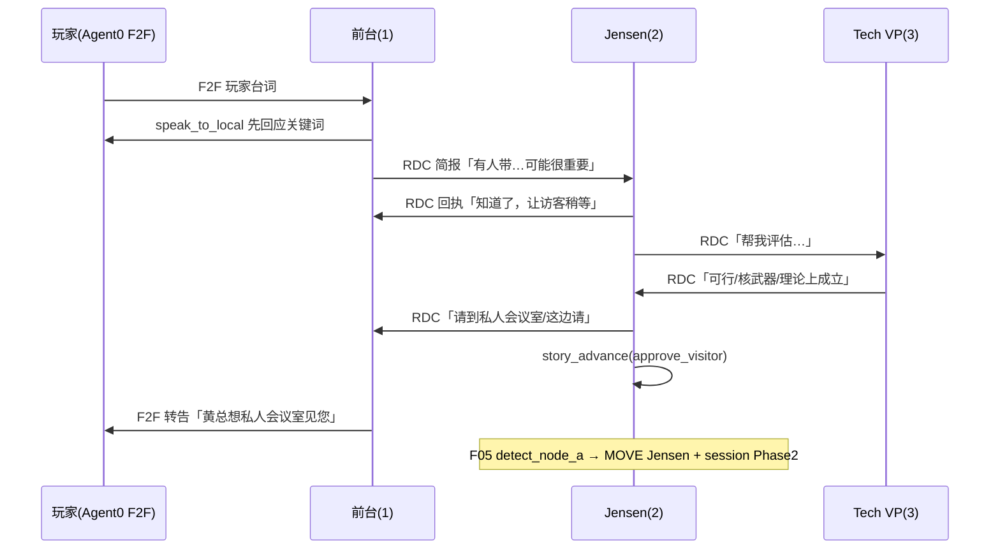

# 开发日志 34：HBM Demo — 剧情 Agent 引导、Prompt 优化与虚拟玩家整合方案

**记录时间**：2026-05-23  
**分支**：`feature/story-scenario-edit`  
**状态**：**方案定稿** · 分阶段实施  
**Feature ID**：**F08 — Virtual Player Entity**（新增）+ **F07 剧情/Prompt 补强**（延续 ABCS）+ **F05 agent_driven 剧情链**（已有，待 Prompt 对齐）

**前置文档**：

- 剧情原型 → [`dev_docs/1_story_prototype.md`](../dev_docs/1_story_prototype.md)
- ABCS / L2–L6 → [`24_HBM_Demo_Agent行为控制整合方案.md`](24_HBM_Demo_Agent行为控制整合方案.md)
- v2 常驻 Runner → [`31_HBM_Demo_Runner控制层详解与引导式Agent方案.md`](31_HBM_Demo_Runner控制层详解与引导式Agent方案.md)
- Agent 原生 / agent_driven → [`30_HBM_Demo_F07-F_Agent原生输出与全量同步方案.md`](30_HBM_Demo_F07-F_Agent原生输出与全量同步方案.md)
- 25 轮参考台词 → [`19_HBM_Demo_25轮参考台词.md`](19_HBM_Demo_25轮参考台词.md)
- 控制机制报告 → [`33_HBM_Demo_Agent控制机制完整报告.md`](33_HBM_Demo_Agent控制机制完整报告.md)

**本分支已落地（commit `a304ebc`）**：

- 删除 `f2f_fallback.py`、`reception_rdc_companion.py` 及 Runner 调用链  
- 删除 `turn_control.yaml` 中 `reception_f2f_fallback` / `reception_rdc_companion`  
- L6 改为 Prompt 软引导（禁止提及「系统代发短句」）

---

## 一、方案目标（不可协商）

| # | 目标 | 验收标准 |
|---|------|----------|
| G1 | **所有玩家可见台词来自 Agent LLM** | 中屏 F2F 无模板句；无系统代写 RDC/F2F |
| G2 | **Phase 切换由 Agent 行为链驱动** | 节点 A/B/C 由 RDC 链 + `story_advance` 触发，非 Turn+Stats 硬门槛 |
| G3 | **玩家输入 strongly 影响 Agent** | 每轮 inject 目标先回应玩家关键词；Phase 2–4 同室 NPC 从 F2F 线程读到玩家话 |
| G4 | **对话像真人、长短得当** | L2 分 Phase 温度/token；L4 详述世界态；输出口语 1–5 句 |
| G5 | **Stats 不参与 Agent/路由 gate** | 左栏展示 only；Turn 25 结局可弱化 Trust 或改 Agent 信号 |
| G6 | **轻量虚拟玩家 Agent** | `agent_id=0` 占位、可 F2F、**永不 tick LLM** |

---

## 二、总体架构：四层分工

```text
┌─────────────────────────────────────────────────────────────────┐
│ L6 + L4 Prompt 软引导（教 Agent 怎么演）                          │
│   soul 精简 + story_knowledge + turn_hints + 玩家中心 inject      │
├─────────────────────────────────────────────────────────────────┤
│ F08 虚拟玩家 Agent 0（对话机制真实化）                            │
│   玩家在 place_store 有实体；玩家输入 → F2F sender=0            │
│   不跑 LLM；同室 NPC 从 Bus/recap 看到玩家                      │
├─────────────────────────────────────────────────────────────────┤
│ F05 agent_driven 路由（切幕执行层）                               │
│   读 world.db：RDC 链 / story_advance / 关键词 → IPC MOVE       │
├─────────────────────────────────────────────────────────────────┤
│ L3 pick_active + L2 llm_params（舞台调度，非替 Agent 说话）       │
│   frozen / primary / passive；Phase 内谁 tick                   │
└─────────────────────────────────────────────────────────────────┘
```

**原则**：Prompt **引导**；虚拟玩家 **补机制**；路由 **执行**；L3 **保底**。禁止再用模板/fallback 替 Agent 说话。

---

## 三、Phase 剧情链（Agent 自主推进）

与 [`dev_docs/1_story_prototype.md`](../dev_docs/1_story_prototype.md) 对齐；**Turn 为规划区间**，实际 Phase 以 session + DB 信号为准。

### 3.1 Phase 1 → 2：前台破局（节点 A）

**决策者**：Jensen（Agent 2）；前台（Agent 1）筛客；Tech VP（Agent 3）评估。



**F05 检测**（已实现 `agent_driven`）：

- RDC 链 1→2、2→3、2→1（批准词）**或** `story_advance(approve_visitor)`
- **Bad End**：前台 F2F 拒绝 / `reject_visitor` / Phase 1 超时（10 Turn），**非** Turn4 Stats

### 3.2 Phase 2 → 3：私密审查（节点 B）

- Jensen 每轮 **先 F2F 回应玩家**（同室，F08 后玩家话在 F2F 线程）
- RDC→Tech VP 求证；VP 正面 RDC 含「可行」「核武器」「理论上成立」
- Jensen 认可 → `story_advance(return_to_negotiation)` 或明确 F2F「回谈判室」
- F05：Jensen MOVE → `negotiation_room` + PlaceMutation

### 3.3 Phase 3 → 4：舌战清场（节点 C）

- NVIDIA 帮玩家；CEO 攻击玩家
- Turn 16 系统广播 + Sam inject（保留，系统事件）
- Jensen 决定请 CEO 离场 → F2F/RDC 驱逐词 + `story_advance(expel_ceos)`
- F05：CEO 4/5/6 MOVE → `nvidia_reception`

### 3.4 Phase 4 → 结局（节点 D）

- inject 仅 `[2]`；Tech VP **present_silent** 旁听
- Jensen 1v1 F2F；Turn 25 意图 + Trust（或改为 `offer_join` / `offer_seed` 信号）

---

## 四、Prompt / 知识库优化（L4 + L6 + soul）

### 4.1 设计原则

| 层级 | 输入（给 LLM 读） | 输出（Agent 说出口） |
|------|-------------------|----------------------|
| L1 soul | 性格、长期目标 | 1 句原则 |
| L4 shared | Phase 世界态、禁止行为、剧情要点 | — |
| L4 agent overlay | 角色目标、example_lines、checklist | — |
| L6 inject | 必须先回应玩家 + Phase/agent 细则 | 1–5 句口语 |
| L2 | — | max_tokens / temperature 上限 |

**混合知识库**（定稿）：`story_knowledge/shared/phase_N.yaml` + `agents/agent_ID.yaml` + `turn_hints.yaml`。

**Stats**：**不写入** Agent Prompt；左栏 UI 展示 only。知识库删除「Turn 4 V+E≥15」等 Stats 硬门槛文案，改为 Agent 驱动描述。

### 4.2 各 Agent Phase 1 Prompt 要点（实施清单）

#### Agent 1 前台

- 先 `speak_to_local` 回应玩家关键词，再判断是否 RDC→2
- 有价值：RDC 简报（不展开技术）；闲聊：仅 F2F，不 RDC
- 收到 Jensen 批准 RDC → F2F 转告玩家去私人会议室
- L6 已增：**禁止沉默或只 RDC 不 F2F**（无系统 fallback）

#### Agent 2 Jensen（Phase 1 在谈判室）

- 收到前台 RDC 后顺序：① RDC→1 回执 ② RDC→3 请 VP 评估 ③ 决定见访客 → RDC→1 批准 + `story_advance(approve_visitor)`
- 禁止对玩家 `speak_to_local`（玩家不在谈判室）
- 同室与 CEO/VP 短句互怼 HBM 涨价（背景压力）

#### Agent 3 Tech VP（Phase 1 被动）

- Jensen RDC 求证时：1–3 句评估；正面含「可行」「核武器」「理论上成立」
- 无 Jensen 未读 RDC 时：偶尔 F2F 插话或 RDC→2

#### L6 增补（`player_response.py` — 待实施）

为 Jensen 增加 `story_advance` 调用说明：

- Phase 1：`approve_visitor`（先 RDC 批准语，再 signal）
- Phase 2：`return_to_negotiation`（先 F2F 告知玩家，再 signal）
- Phase 3：`expel_ceos`

### 4.3 知识库文件待改清单

| 文件 | 改动 |
|------|------|
| `shared/phase_1.yaml` | `plot_beats` 去掉 Turn4 Stats；改为 RDC 链 + story_advance |
| `shared/phase_2.yaml` | 去掉 Turn12 Execution 硬门槛；改为 VP 正面 RDC + Jensen 认可 |
| `shared/phase_3.yaml` | 去掉 Turn20 Burnout/Vision 硬门槛；改为 Jensen 清场信号 |
| `agents/agent_1.yaml` | Phase 1 role_goal / example_lines（见 §4.2） |
| `agents/agent_2.yaml` | Phase 1–4 role_goal + story_advance 时机 |
| `agents/agent_3.yaml` | Phase 1/2 被动 RDC 规格 |
| `hbm_scenario.yaml` soul | 各 Agent 增补 Phase 行为剧本（与 overlay 一致，不重复 Stats 规则） |

---

## 五、F08 虚拟玩家 Agent（轻量、不跑 LLM）

### 5.1 定义

```yaml
# hbm_scenario.yaml 新增
agents:
  - agent_id: 0
    name: "玩家"
    location: nvidia_reception   # 随 session.place_id IPC 同步
    soul: ""                     # 空；永不 perform_action_by_llm
```

| 属性 | 规格 |
|------|------|
| **agent_id** | `0`（与现有 `PLAYER_RECIPIENT_ID=0` 一致） |
| **place_store** | 注册于当前 `session.place_id` |
| **pick_active** | **永久 frozen**，不进入任何 tick LLM |
| **玩家输入** | Flask `player-turn` → 写 **F2F**（sender=0, recipient=同室 NPC 或 0 广播行） |
| **Phase 切换** | F05 路由时 **IPC MOVE agent 0** 与 Jensen 同步 |
| **禁止** |  DialogueInjection 替玩家跑 LLM；agent 0 调用任何 tool |

### 5.2 与现有机制的关系

| 现状 | F08 后 |
|------|--------|
| 玩家话 → inject → `player_memory` | **同室 Phase**：玩家话 → **F2F sender=0**；NPC 从 recap/F2F 读 |
| `emit_player_facing_f2f`（NPC→玩家） | 保留：NPC `speak_to_local` 时 recipient=0（或 co-agent 存在时走 Bus） |
| Phase 1 Jensen 看不到玩家原文 | **不变**：Jensen 仅 notification + 前台 RDC，符合剧情 |
| Phase 2 inject 仅 `[2]` | Jensen 从 **F2F 线程**读玩家；可弱化 `player_memory` 双通道 |

### 5.3 玩家输入管线（目标）

```text
POST /player-turn
  ├─ F04 score_player_turn（Stats UI only，不进 Agent Prompt）
  ├─ F08 emit_player_f2f(agent_id=0, place_id, content=player_text)
  ├─ [可选] 本 Phase inject 目标仍收 L6 前缀（Phase 1 前台）
  ├─ ENQUEUE_PLAYER_INPUT（turn_context + events 若仍需要 notification）
  └─ World loop tick → 同室 NPC 观测含玩家 F2F
```

**Phase 分策略**：

| Phase | 玩家 F2F | inject / L6 | 说明 |
|-------|----------|-------------|------|
| 1 | ✅ agent 0 @ reception | 前台 `[1]` 保留 L6 全文 | Jensen 仍靠 RDC |
| 2 | ✅ agent 0 @ jensen_private_room | `[2]` L6 可缩短（F2F 已有全文） | 1v1 最大收益 |
| 3 | ✅ agent 0 @ negotiation_room | batch `[2–6]` + F2F | CEO 可从 recap 见玩家 |
| 4 | ✅ agent 0 @ negotiation_room | `[2]` only | 终局 1v1 |

### 5.4 模块结构（待建）

```text
agent_world/hbm_demo/features/f08_virtual_player/
├── __init__.py
├── player_entity.py      # agent 0 注册、MOVE 同步
├── player_f2f.py         # player-turn → insert F2F from sender=0
└── config.yaml           # enabled, agent_id: 0
```

**改动锚点**：

| 文件 | 变更 |
|------|------|
| `hbm_scenario.yaml` | 增加 agent 0 |
| `kernel.py` | 创建 agent 0 占位（无 LLM client 或 stub） |
| `pick_active.py` | 永远排除 agent 0 |
| `f02_player_turn/handler.py` | player-turn 调用 F08 emit |
| `f05_story_routing/routing.py` | 节点 A/B 时 IPC MOVE agent 0 |
| `f01_session/constants.py` | name_map 含 `"0": "玩家"` |
| `web` name_map | 与后端一致 |

### 5.5 可废弃项（F08 稳定后）

- 逐步减少 inject 对 `player_memory` 的依赖（Phase 2+ 优先）
- `emit_player_facing_f2f` 保留 NPC→玩家方向，逻辑可简化

---

## 六、Stats 策略

| 项 | 策略 |
|----|------|
| F04 打分 | **保留**，每轮更新左栏 |
| 路由 A/B/C | **已** `agent_driven`，不看 Stats |
| Turn 4 Bad End | **已** 关闭 Stats gate；Agent 拒绝 / 超时 |
| Agent Prompt | **不注入** Stats |
| Turn 25 结局 | **Phase 2 可选改**：`story_advance(offer_join/offer_seed)` + 意图 LLM，Trust 仅作 tie-break |
| `stats_display_only` | 配置已有，建议代码层删除 legacy `_legacy_node_*` 或文档标注 deprecated |

---

## 七、已删除的硬编码路径（勿恢复）

| 已删 | 原因 |
|------|------|
| `f2f_fallback.py` 模板 F2F | 替 Agent 说话 |
| `reception_rdc_companion.py` | 替前台写 RDC |
| `world_loop` 批末 fallback | 同上 |
| L6「系统代发短句」 | 与 G1 冲突 |

**仍保留（非 Agent 台词代写）**：

- `IMMEDIATE_MSG_PLACEHOLDER`：API1 UI 占位，不进 world.db
- Turn 16 广播 / Sam inject：系统剧情事件
- Bad End stub：仅 DB 无拒绝 F2F 时的 UI 兜底（可后续改为必须 Agent 拒绝）

---

## 八、实施路线图（分 PR）

### PR0 — 已完成 ✅ `a304ebc`

- 删除 scripted fallback + RDC companion
- L6 软引导补强

### PR1 — Prompt / 知识库对齐（F07 剧情补强）

| 项 | 内容 |
|----|------|
| P1.1 | 更新 `shared/phase_*.yaml` 去掉 Stats 硬门槛 |
| P1.2 | 更新 `agents/agent_{1,2,3}.yaml` + `hbm_scenario.yaml` soul |
| P1.3 | L6 增补 Jensen `story_advance` 时机（`player_response.py`） |
| P1.4 | `turn_hints.yaml` 按 Phase 节点对齐 |

**验收**：本地 Phase 1 跑 3–5 轮，Observer 见完整 RDC 链；无模板 F2F。

### PR2 — F08 虚拟玩家 Agent

| 项 | 内容 |
|----|------|
| P2.1 | scenario + kernel agent 0 + pick_active 排除 |
| P2.2 | `player-turn` → F2F sender=0 |
| P2.3 | F05 路由 MOVE agent 0 |
| P2.4 | Phase 2 E2E：Jensen F2F 回应来自 F2F 线程 |

**验收**：Phase 2 中屏/dialogue 来自 Agent F2F；thread recap 含玩家句；agent 0 无 LLM 请求日志。

### PR3 — F03 完成语义 + 结局

| 项 | 内容 |
|----|------|
| P3.1 | Phase 1/4 F2F 优先 completed（§13.2/13.5 dev_log/24） |
| P3.2 | Turn 25 结局弱化 Trust 或接 `offer_*` 信号 |
| P3.3 | `test_m0_acceptance` 扩展 agent_driven 链断言 |

### PR4 — 可选收尾

- Phase 2+ 减少 `player_memory` inject 双通道
- 简化 `emit_player_facing_f2f`
- 更新 dev_log/33 反映 fallback 已删除

---

## 九、验收 Checklist（整体）

### 行为

- [ ] Phase 1：前台 F2F 先回应玩家；有价值则 RDC 链；Jensen 发 `approve_visitor` 后进 Phase 2
- [ ] Phase 2：Jensen 每轮 F2F 回应玩家；VP 正面 RDC 后进 Phase 3
- [ ] Phase 3：NVIDIA 帮玩家；Turn 16 广播；Jensen 清场后进 Phase 4
- [ ] Phase 4：仅 Jensen 与玩家 F2F；VP 无输出
- [ ] 全程无「您提到的{kw}，我需要跟黄总确认」类模板句

### 机制

- [ ] agent 0 在 place_store，**从不**出现在 LLM tick 日志
- [ ] 玩家输入产生 sender=0 的 F2F 行
- [ ] Phase 切换时 agent 0 与 session `place_id` 一致
- [ ] Stats 变化不影响路由；左栏仍更新

### 回归

- [ ] `test_m0_acceptance.py` 全过
- [ ] `npm run build` 通过
- [ ] 剧情模式 + 上帝模式 UI 正常

---

## 十、风险与回滚

| 风险 | 缓解 |
|------|------|
| 删 fallback 后 Phase 1 中屏空 | PR1 Prompt 强化 + PR2 玩家 F2F；人工试玩 Turn1–4 |
| inject + F2F 双通道重复 | Phase 2+ 逐步只保留 F2F |
| agent 0 误进 tick | pick_active hard exclude + 无 soul/无 LLM client |
| 回滚 fallback | **不建议**；若必须，恢复 git `f2f_fallback.py` 但默认 false |

---

## 十一、与 Feature 注册关系

| Feature | ID | 目录 | 状态 |
|---------|-----|------|------|
| ABCS / Prompt | F07 | `features/f07_agent_control/` | 进行中 · PR1 |
| 虚拟玩家 | **F08** | `features/f08_virtual_player/` | 待建 · PR2 |
| 路由 agent_driven | F05 | `features/f05_story_routing/` | 已实现 · Prompt 对齐 PR1 |
| 全量 UI | F12/F16 | 已有 | 不变 |

在 `features/__init__.py` 注册 F08：`status: planned` → `in_progress` → `implemented`。

---

## 十二、方案命名

| 项 | 值 |
|----|-----|
| 方案代号 | **Story Agent Native（SAN）** |
| 核心公式 | **Prompt 引导 + 虚拟玩家 F2F + agent_driven 路由** |
| 文档版本 | **v1.0** · 2026-05-23 |
| 分支 | `feature/story-scenario-edit` |
| 下一步 | **PR1 Prompt/知识库** → **PR2 F08 虚拟玩家** |

---

*本文档为 HBM Demo 剧情体验升级的**单一实施依据**；Prompt 细则以 §4 + [`24`](24_HBM_Demo_Agent行为控制整合方案.md) 为准，路由以 [`dev_docs/1`](../dev_docs/1_story_prototype.md) + F05 `agent_signals.py` 为准，虚拟玩家以 §5 为准。*
