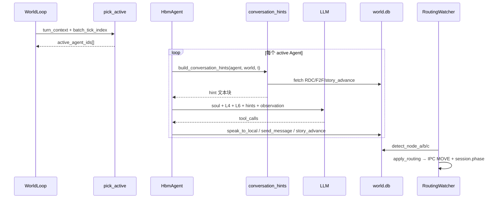

# 开发日志 35：HBM Demo — Agent 控制方案与软引导实施记录

**记录时间**：2026-05-23  
**分支**：已合并至 `jensen-hwang-demo`（原 `feature/story-scenario-edit`）  
**状态**：**实施定稿** · 联调验证中  
**文档性质**：当前 Demo **Agent 硬/软控制** 的权威说明，含 2026-05-23 联调期软引导改动与已知坑修复

**前置文档**：

- [`34_HBM_Demo_剧情Agent引导与虚拟玩家整合方案.md`](34_HBM_Demo_剧情Agent引导与虚拟玩家整合方案.md) — SAN 总方案、PR0–PR4、节点 A/B/C 叙事
- [`33_HBM_Demo_Agent控制机制完整报告.md`](33_HBM_Demo_Agent控制机制完整报告.md) — 运行时全景（**部分 L5/E 系列描述已过时，以本文 §二 为准**）
- [`31_HBM_Demo_Runner控制层详解与引导式Agent方案.md`](31_HBM_Demo_Runner控制层详解与引导式Agent方案.md) — v2 常驻 World Loop 目标架构
- [`24_HBM_Demo_Agent行为控制整合方案.md`](24_HBM_Demo_Agent行为控制整合方案.md) — ABCS L2–L6 原设计

**关联代码**：

| 模块 | 路径 |
|------|------|
| L3 硬控制 | `features/f07_agent_control/pick_active.py` |
| 软引导 | `features/f07_agent_control/conversation_control.py` |
| L4 知识库 | `features/f07_agent_control/knowledge.py` + `story_knowledge/**` |
| L6 玩家约束 | `features/f07_agent_control/player_response.py` |
| 配置 | `features/f07_agent_control/turn_control.yaml` |
| Runner 短规则 | `core/runner/hbm_agent.py` |
| 切幕硬执行 | `features/f05_story_routing/` |
| 虚拟玩家 | `features/f08_virtual_player/` |

**手工验收**：[`agent_world/hbm_demo/scripts/player_playthrough.md`](../agent_world/hbm_demo/scripts/player_playthrough.md)

---

## 一、设计原则（v2 Prompt-First）

| 原则 | 含义 |
|------|------|
| **硬控制只管「谁动」** | L3 `pick_active` 决定本 tick 哪些 Agent 调 LLM；frozen Agent 本 Phase 不调 LLM |
| **软控制管「怎么说 / 往哪推」** | L4 + L6 + 动态 `conversation_hints` 写入 prompt；**不拦截 LLM 工具** |
| **切幕是硬副作用** | Phase 切换、Agent MOVE 仅由 **F05 读 world.db** 触发 IPC；LLM 的 `request_move` 被引擎忽略 |
| **禁止脚本代说** | 已删除 `f2f_fallback.py`、`reception_rdc_companion.py`；无模板替 Agent 写 F2F/RDC |
| **experience_hardening 退役** | `turn_control.yaml` 中 `experience_hardening.enabled: false`；E1/E2 硬守卫默认不生效 |

与 dev_log/31 v2.0 对齐：**只保留 L3 作为硬 gate**；L5 `filter_tool_calls` 已从 `hbm_agent.py` 移除。

---

## 二、总体架构：四层分工

```text
┌─────────────────────────────────────────────────────────────────┐
│ 动态软引导 conversation_hints（读 world.db，每 tick 注入）        │
│   节点 A checklist · RDC 必回 · 止复读 · Jensen 批准 urgency    │
├─────────────────────────────────────────────────────────────────┤
│ L4 Story Bible + L6 玩家约束 + hbm_agent 短规则                  │
│   phase_*.yaml · agent_*.yaml · turn_hints · inject 模板         │
├─────────────────────────────────────────────────────────────────┤
│ F08 虚拟玩家 Agent 0（机制层，不 tick LLM）                       │
│   玩家 F2F → world.db sender=0；Phase 切换时 F05 MOVE agent 0    │
├─────────────────────────────────────────────────────────────────┤
│ F05 agent_driven 路由（切幕执行层）                               │
│   detect_node_a/b/c · story_advance_log · IPC MOVE             │
├─────────────────────────────────────────────────────────────────┤
│ L3 pick_active + L2 llm_params（硬：谁在本 tick 思考）           │
│   inject_exclusive · unread 刺激 · 开场 · passive 采样          │
└─────────────────────────────────────────────────────────────────┘
```

**数据流（单 tick）**：



---

## 三、硬控制：L3 `pick_active`

**配置**：`features/f07_agent_control/turn_control.yaml`  
**实现**：`features/f07_agent_control/pick_active.py`

### 3.1 激活优先级（高 → 低）

| 顺序 | 条件 | 行为 |
|------|------|------|
| 1 | `inject_exclusive` 窗口内 | 仅 inject 目标 Agent（Phase 1：`inject_exclusive_ticks: 2`） |
| 2 | primary Agent **有未读** RDC/F2F | 必须进入 active（`has_unread_inbound`） |
| 3 | inject 目标 **`player_memory` 非空** | 继续 tick 直到回应完 inject |
| 4 | inject 批次窗口 | `batch_tick_index < inject_response_ticks`（Phase 1：4）时 inject 目标活跃 |
| 5 | **开场 beat** | Phase 1、`batch_tick_index==0`、DB 尚无前台 F2F → 仅 Agent1 一次 welcome |
| 6 | **被动采样** | CEO 4/5/6：`passive_low_freq` + 概率；Phase 1 在谈判室时更易被采样 |

**空闲行为**：无 inject、无 unread、非开场 → `active=[]`，Runner 不空转 LLM（stimulus-driven）。

### 3.2 各 Phase 角色表

| Phase | `primary_active` | 被动 / 冻结 |
|-------|------------------|-------------|
| Phase 1 | 1, 2, 3 | CEO 4/5/6 被动；Sam(7) 冻结 |
| Phase 2 | 2 | 前台(1) 冻结；VP(3) `passive_rdc_reply` |
| Phase 3 | 2, 3, 4, 5, 6 | 前台冻结；Turn≥16 Sam 加入 primary |
| Phase 4 | 2 | VP(3) `present_silent`；CEO/Sam 冻结 |

### 3.3 inject 批次长度

`resolve_inject_tick_count(phase, tick_count)`：

- Phase 1 最少 **8 tick**（保证 NPC 有足够轮次回应玩家）
- experience_hardening 关闭时不再 floor 到 12

### 3.4 开场与 session 镜像（2026-05-23 修复）

| 问题 | 修复 |
|------|------|
| 高 `current_tick` 时 `t<=1` 永远不 welcome | 改为 `_reception_opening_pending()`：DB 检查 + `start_tick` + `batch_tick_index==0` |
| 新 session 继承旧 L3 窗口 | `turn_context.start_tick` 进 mirror；`start_tick` 变化时 **reset L3**（`world_loop.update_session_mirror`） |
| session/start 后 loop 仍 paused | `http/routes.py`：start 时若 paused 则 resume |

### 3.5 虚拟玩家

`pick_active` **永不**激活 Agent 0（`is_virtual_player_agent` 过滤）。玩家由 F08 写 F2F，由 F05 MOVE。

---

## 四、软控制：Prompt 三层

### 4.1 L4 — Story Bible（静态知识）

**模块**：`knowledge.py` + `story_knowledge/`

| 文件 | 内容 |
|------|------|
| `shared/phase_1.yaml` … `phase_4.yaml` | 世界态、节点 A/B/C 叙事顺序、禁止动作 |
| `agents/agent_1.yaml` … `agent_7.yaml` | 角色职责、Phase 内行为要点 |
| `turn_hints.yaml` | 按 Turn 的额外提示 |

**注入时机**：玩家 inject 时组装 `build_agent_knowledge()`，含 thread recap（近 `recap_window_ticks` 条 F2F/RDC 摘要）。

### 4.2 L6 — 玩家中心约束

**模块**：`player_response.py`

- `format_l6_player_directive` / `format_f2f_aware_inject_directive`：Phase 2+ 从同室 F2F 读玩家话，不重复 inject 原文
- 各 Agent Phase 专属 ★ 条目（RDC 必回、节点 A 链、禁止帮 CEO 说话等）
- Phase 1 前台：必须先 `speak_to_local` 再 RDC→Jensen；Jensen「稍等」只 F2F 转告，禁止 RDC 回执

### 4.3 Runner 短规则

**模块**：`hbm_agent.py` → `_hbm_short_action_rules()`

按 Phase × Agent 追加 3–5 行硬格式规则（与 L6 互补），例如 Phase 1 Jensen：

> VP 回评估后 `send_message→1` 批准语（私人会议室/这边请），再 `story_advance(approve_visitor)` 进 Phase 2。

### 4.4 动态软引导 — `conversation_control.py`

**入口**：`build_conversation_hints(agent_id, agent, world, t)`  
**调用**：每 tick LLM 决策前由 `hbm_agent.perform_action_by_llm` 拼入 system prompt。

**设计约束**（文件头注释）：

- 有未读 inbound → 鼓励本拍回复，避免 `do_nothing` 拖延
- inject 回应后 → 提示可 `do_nothing`，避免复读
- 出站 RDC 无回复 → **soft** 止 spam（**不** hard block 工具）

#### 4.4.1 Hint 模块一览

| 函数 | 触发 | 作用 |
|------|------|------|
| `_move_and_location_hints` | Phase 1–3 | 禁止编造 MOVE；前台补充「routing 处理转场，勿说系统限制无法移动」 |
| `_negotiation_room_hints` | 谈判室 Phase 1 | Jensen/VP/CEO 须 `speak_to_local` 形成可见讨论 |
| `_node_a_progress_hints` | Phase 1 | 读 DB 的节点 A 分步 checklist（1→2、2→3、批准、escort） |
| `_rdc_reply_obligation_hints` | 有未读 RDC | 必须 reply；Jensen 批准 pending 时改「须批准」而非「稍等/评估」 |
| `_jensen_reception_spam_hints` | Jensen Phase 1 | VP 已认可 → **必须批准** hint；否则限制「稍等」复读 |
| `_jensen_vp_link_hints` | Jensen Phase 1 | Jensen↔VP RDC 顺序（回前台 → 问 VP → 等 VP） |
| `_reception_jensen_spam_hints` | 前台 Phase 1 | 已报访客 → 勿重复 RDC→2；**已批准 → escort hint** |
| 收件箱 hint | `has_unread_inbound` | RDC 用 send_message，同室 F2F 用 speak_to_local |

#### 4.4.2 节点 A DB 检测 helper（软引导侧）

与 F05 `detect_node_a` 共用 `routing_config.approve_keywords()`，只读 DB、不写硬逻辑：

| Helper | 含义 |
|--------|------|
| `_has_approve_rdc_to_reception` | Jensen(2)→前台(1) RDC 含批准关键词 |
| `_vp_positive_rdc_to_jensen` | VP(3)→Jensen(2) 含「可行/理论上成立/放他进来」等 |
| `_jensen_node_a_chain_ready` | 存在 1→2、2→3、3→2 RDC 对 |
| `_jensen_should_issue_approve` | 链齐 + VP 正面 + **尚无**批准 RDC |
| `_jensen_approve_urgency_hints` | 输出「【节点 A·必须批准】…」全文 hint |

**玩家等候加权**：`player_turn>=3` 或前台玩家 F2F≥2 次时，urgency 文案前缀「玩家已在前台多次发言等候——」。

#### 4.4.3 `_jensen_approve_urgency_hints` 标准文案

```
【节点 A·必须批准】{urgency}Tech VP 已正面评估访客方案，RDC 链已齐。
本拍须 send_message→1，正文含「私人会议室/这边请/可以见」之一，
并同批调用 story_advance(approve_visitor)。
禁止再写「稍等/十分钟/还在谈」；禁止本拍只 speak_to_local 拖延。
```

#### 4.4.4 `mark_communication_action`

出站 `send_message` 后记录 `_pending_rdc_out` / `_last_rdc_out_content`，供后续 hint 判断 spam 与 reply 义务。

---

## 五、节点 A：软引导 vs 硬路由

### 5.1 叙事链（Prompt 教 Agent 演）

```text
玩家 F2F → 前台 speak_to_local + RDC→Jensen(1→2)
         → Jensen RDC→前台回执 + RDC→VP(2→3)
         → VP RDC→Jensen 技术评估(3→2)
         → Jensen RDC→前台 批准语(2→1) + story_advance(approve_visitor)
         → 前台 F2F escort（叙事；非硬门槛）
         → F05 IPC MOVE → Phase 2
```

### 5.2 硬检测 `detect_node_a`（F05）

**模块**：`features/f05_story_routing/agent_signals.py`  
**配置**：`routing.yaml` → `mode: agent_driven`

满足 **任一** 即节点 A：

1. `story_advance_log` 含 `approve_visitor`
2. RDC 链 1→2、2→3 存在 + Jensen 2→1 含 `approve_keywords` + （可选）前台 escort F2F

**当前 `approve_keywords`**（`routing.yaml`）：

```yaml
- 私人会议室   # 2026-05-23 新增（LLM 实际用词）
- 私密会议室
- 可以见
- 带进来
- 批准
- 这边请
- 请跟我来
```

**escort 门槛**（2026-05-23 调整）：

```yaml
require_reception_escort_f2f: false
```

Jensen 批准 RDC 即可触发切幕；前台 escort 仍为 **软引导**（`_node_a_progress_hints` / L6），非硬 gate。

### 5.3 2026-05-23 联调发现的软/硬冲突与修复

| 现象 | 根因 | 修复 |
|------|------|------|
| Jensen 一直「稍等」不批准 | `_jensen_reception_spam_hints` 在 2+ 条 2→1 RDC 后 **禁止 send_message→1** | VP 正面 + 无批准 RDC 时改发 **必须批准** hint，覆盖 spam |
| VP 正面检测永不触发 | `_rdc_row_content` 对 `sqlite3.Row` 用 `getattr` 读不到 `content` | 改为 `row["content"]` |
| 批准 RDC 已有仍不进 Phase 2 | 关键词「私密」≠ LLM「私人」 | `approve_keywords` 增加「私人会议室」 |
| 有批准仍卡 Phase 1 | `require_reception_escort_f2f: true` 硬等前台「这边请」 | 改为 `false` |
| 前台说「系统限制无法移动」 | 位置 hint + 未切 Phase 叠加 | 前台专用 hint：routing 处理转场；批准后 escort hint 禁止再安抚 |

### 5.4 `story_advance` 工具

**注册**：`hbm_agent.py` → tool `story_advance`  
**信号名**：`approve_visitor` | `return_to_negotiation` | `expel_ceos` | `reject_visitor`  
**作用**：写 `story_advance_log`；**不替 Agent 生成台词**。软引导要求 Jensen 批准时 **RDC + story_advance 同批**。

---

## 六、硬控制：F05 切幕与 F08 玩家移动

| 节点 | 检测 | 副作用 |
|------|------|--------|
| A | `detect_node_a` | Jensen MOVE → `jensen_private_room`；F08 MOVE Agent0；`session.phase=Phase 2` |
| B | `detect_node_b` | Jensen MOVE → `negotiation_room`；Phase 3 |
| C | `detect_node_c` | Phase 4；CEO 离场等 |

**扫描时机**：

- World Loop 模式下：`RoutingWatcher.scan_routing_if_needed` 在每次 F14 `GET /world-delta` 时触发
- Legacy inject 批末：`routing.apply_routing`（v2 玩家 turn 以 watcher 为主）

**Watcher 去重**（2026-05-23）：

- `applied_routing_nodes`：同一节点不重复 `apply_routing` 入队事件
- 路由事件 ID 稳定：`route_node_A` / `route_node_B` / `route_node_C`（非 task_id 后缀）
- `pending_world_events` 按 ID 去重后再 extend

---

## 七、已删除 / 退役的硬控制

| 组件 | 原作用 | 现状 |
|------|--------|------|
| `f2f_fallback.py` | 模板 F2F 兜底 | **已删除**（dev_log/34 PR0） |
| `reception_rdc_companion.py` | 脚本 RDC 伴生 | **已删除** |
| L5 `filter_tool_calls` | 硬拦非法 tool | **已移除** |
| `experience_hardening` E1/E2 | 必先 F2F、RDC quota | **`enabled: false`** |
| Stats gate 节点 A | Turn4 + vision+execution | **agent_driven** 下由 DB 信号替代 |
| `require_reception_escort_f2f` | 硬等 escort F2F | **`false`** |

---

## 八、配置速查 `turn_control.yaml`

```yaml
enabled: true
experience_hardening:
  enabled: false          # v2 Phase 0 退役硬守卫

phases:
  Phase 1:
    primary_active: [1, 2, 3]
    passive_low_freq: [4, 5, 6]
    frozen: [7]
    inject_exclusive_ticks: 2
    inject_response_ticks: 4
    primary_notify_ticks: 3
    passive_tick_probability: high

world_loop:
  enabled: true
  tick_interval_sec: 1.0

llm_params:
  Phase 1: { temperature: 0.45, max_tokens: 180 }
  Phase 2: { temperature: 0.50, max_tokens: 220 }
  # ...
```

**路由**（`routing.yaml` 摘要）：

```yaml
routing:
  mode: agent_driven
  stats_display_only: true
  signals:
    require_reception_escort_f2f: false
  story_advance:
    enabled: true
```

---

## 九、硬 / 软职责边界（速查表）

| 事项 | 硬（代码） | 软（Prompt） |
|------|------------|--------------|
| 本 tick 谁调 LLM | ✅ L3 | — |
| Phase / 地点切换 | ✅ F05 + IPC MOVE | hint 催促 story_advance / 批准 RDC |
| 节点 A 是否满足 | ✅ detect_node_a + keywords | checklist + urgency hints |
| Agent 能否 MOVE | ✅ 引擎忽略 request_move | 位置约束 hint |
| 禁止 RDC 复读 | — | spam hints |
| Jensen 何时批准 | — | approve urgency + L6 + L4 |
| 工具调用是否拦截 | —（**不拦截**） | L6 + short_action_rules |
| 玩家台词入库 | ✅ F08 insert F2F | L6 inject 模板 |

---

## 十、联调期其他修复（与 Agent 可见性相关）

以下问题影响「Agent 是否在 UI/DB 有输出」，一并记录：

| 问题 | 修复位置 |
|------|----------|
| LLM 全 tick 静默 | `story_signals.py`：`since_tick` 参数名；`world/step.py` TypeError fallback |
| 前端 delta 漏消息 | `hydrateWorldSnapshot.ts` 游标；`worldSync.ts` public_messages 去重 |
| 玩家台词重复 | `messages.ts` 玩家 F2F 按内容去重 |
| 世界事件弹窗重复 | `processedWorldEventIds` + 稳定 `route_node_*` ID |

详见 commit `a622b84`（`jensen-hwang-demo`）。

---

## 十一、验收与测试

| 类型 | 命令 / 文件 |
|------|-------------|
| 单元 | `npx tsx agent_world/hbm_demo/web/scripts/test_world_sync.ts` |
| 验收 | `python3 agent_world/hbm_demo/scripts/test_m0_acceptance.py`（T2d F07-B、T2q Phase4） |
| 手工 | `scripts/player_playthrough.md` Turn 1–3 节点 A |

**通过标准（节点 A）**：

1. 前台 welcome + 回应玩家 F2F  
2. RDC 链 1→2→3→2 可在 world.db 看到  
3. Jensen 发含「私人会议室」的 2→1 RDC 或 `story_advance(approve_visitor)`  
4. UI Phase 2 + 场景 `jensen_private_room`  
5. 玩家每条台词仅显示一次；转场 modal 每种事件点一次关闭  

**运行注意**：Python/Runner 改动需重启 `./agent_world/hbm_demo/scripts/start_demo.sh`；前端刷新即可。

---

## 十二、后续可优化（未实施）

| 项 | 说明 |
|----|------|
| 软引导与 detect 完全同构 | 可将 `_jensen_should_issue_approve` 与 `detect_node_a` 共用单一模块，减少 drift |
| Phase 切换 PhaseToast vs WorldEventModal | 可考虑合并为一种 UI 提示 |
| `dev_log/33` 同步 | 33 仍写 L5 filter；应在下次修订时指向本文 §一、§七 |
| experience_hardening 代码删除 | 配置已关，源码可后续清理减维护面 |

---

## 十三、变更历史

| 日期 | 内容 |
|------|------|
| 2026-05-23 | 初稿：合并 dev_log/34 实施结果 + 当日联调软引导改动与 Phase 1→2 修复 |
| 2026-05-23 | 合并至 `jensen-hwang-demo`，删除 `feature/story-scenario-edit` |

**关键 commit**（`jensen-hwang-demo`）：

- `523ac90` … `ca49107` — dev_log/34 PR1–PR4  
- `017befc` — 测试整合 + playthrough  
- `a622b84` — Phase 1→2 路由、可见性、去重、Jensen 软引导  

---

*本文档为 Agent 控制与软引导的 **实施记录**；方案级目标仍以 dev_log/34 为准，运行时全景参见 dev_log/33（以本文 §一、§七 更新 L5/E 状态）。*
